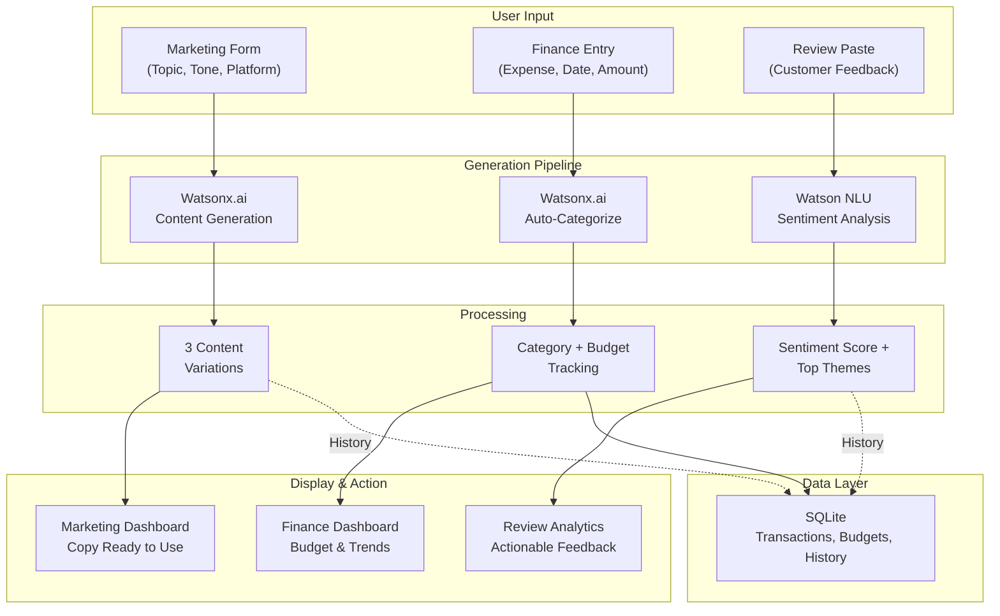
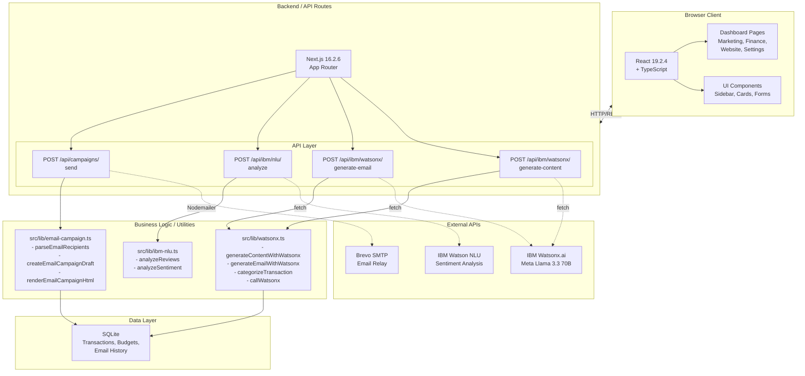

# SmallBox

<div style="margin: -10px 0;" align="center">
           <br />
  <p align="center">
    <a href="https://devpost.com/software/recall-y8i430">
      <strong>« IBM-UNSA DevPost »</strong>
               <br />
    </a>
  </p>
</div>

SmallBox is a self-serve web application that democratizes access to enterprise-grade IBM tools—without requiring technical expertise. Small business owners can now access AI-powered content generation, intelligent financial management, and data-driven marketing insights through an intuitive dashboard.

Real-time AI content generation answers "What should I post?" with one click. Intelligent expense categorization answers "Where is my money going?" with automatic transaction analysis. Sentiment analytics answers "What do customers really think?" with one-tap review analysis. All designed to be simple, private, and always on your side.

<div align="center">
  <a href="https://www.youtube.com/watch?v=RnzwBhRtdv8">
    
  </a>
</div>

---

## The Problem

Small business owners **lack access to enterprise tools**—their competitors with dedicated IT teams use AI-powered automation, advanced analytics, and intelligent workflow tools. They face three critical challenges:

1. **Time Poverty**: Manually writing social posts, categorizing expenses, and analyzing customer feedback consumes hours weekly
2. **Resource Constraints**: Can't afford specialized software or hire data analysts
3. **Knowledge Gap**: IBM's powerful tools (Watsonx.ai, Watson NLU) are designed for enterprise teams, not small business owners

Existing solutions are fragmented: generic marketing apps don't personalize content; spreadsheets don't automatically categorize transactions; review platforms don't extract actionable insights. **SmallBox exists because business intelligence should live in one place**, accessible to any business owner.

---

## How It Works

SmallBox combines three core pipelines:

1. **AI Content Generation** (Watsonx.ai) — Turn business context into marketing copy
2. **Intelligent Finance** (Watsonx.ai + SQLite) — Auto-categorize transactions, track budgets, generate insights
3. **Customer Intelligence** (Watson NLU) — Analyze sentiment, extract themes, recommend improvements

All data stays private; credentials are stored securely on the server; the frontend handles UI and display only.

### High-Level Flow



### Marketing Content Pipeline

The **Marketing Dashboard** combines AI content generation with email campaign management:

1. **Content Generation**: User inputs topic (product/service), tone, and platform (Instagram, Facebook, Email, Ad copy)
2. **Watsonx.ai Processing**: Sends context to Meta Llama 3.3 70B Instruct model; generates 3 unique variations
3. **Draft Preview**: User sees all variations, edits inline, copies to clipboard or schedules send
4. **Email Integration**: If email selected, user can parse recipient list (CSV or manual), generate subject + body, and send via Brevo SMTP
5. **Campaign Tracking**: Each campaign logged with source (AI or manual), timestamp, and recipient count

### Finance Intelligence Pipeline

The **Finance Dashboard** provides transaction management with AI-powered categorization:

1. **Manual Entry or Upload**: User adds expenses/income manually or uploads receipt/statement
2. **Auto-Categorization**: Watsonx.ai analyzes description and amount; suggests category (Food, Rent, Utilities, Supplies, etc.)
3. **Budget Tracking**: Monthly targets set per category; dashboard shows progress, alerts near/over limit
4. **Insights & Reports**: End-of-month summary with spend trends, biggest expense categories, and savings recommendations
5. **Persistent History**: All transactions stored in SQLite; searchable, filterable, exportable

### Customer Intelligence Pipeline

The **Review Analyzer** (Marketing tab) extracts value from customer feedback:

1. **Paste Reviews**: User inputs customer reviews from Google, Yelp, or manual sources
2. **Sentiment Extraction**: Watson NLU processes reviews; returns overall sentiment score (0-100), top positive themes, top complaints
3. **Keyword Cloud**: Visualizes most-mentioned terms (positive and negative)
4. **Actionable Feedback**: AI suggests 1–2 improvements based on negative themes and complaint patterns
5. **Trend Analysis**: If multiple analysis batches submitted, tracks sentiment over time

---

## System Architecture



### Frontend Layer

- **React 19.2.4 + TypeScript + Vite**: Component-based UI with server-side rendering via Next.js
- **Tailwind CSS + Framer Motion**: Utility-first styling with smooth animations
- **Dashboard Pages**: 
  - `Marketing` — Content generation, email campaigns, review analyzer
  - `Finance` — Transaction entry, budget tracking, analytics, reports
  - `Website` — (v2 planned) Website builder with template system
  - `Settings` — User account management
- **Sidebar Navigation**: Persistent left nav with sections (Home, Marketing, Finance, Website, Settings)
- **WatsonChat Component**: Optional chat interface for natural language queries (lazy-loaded)

### Backend / API Routes

- **Next.js App Router**: REST endpoints only (no GraphQL, no WebSockets)
- **Watsonx Content Generation** (`POST /api/ibm/watsonx/generate-content`): Marketing content with 3 variations
- **Watsonx Email Generation** (`POST /api/ibm/watsonx/generate-email`): Email draft with subject, body, CTA
- **Watson NLU Analysis** (`POST /api/ibm/nlu/analyze`): Sentiment analysis + keyword extraction
- **Email Campaign Send** (`POST /api/campaigns/send`): Nodemailer + Brevo SMTP delivery
- **Finance CRUD** (`/api/finance/*`): Transaction and budget management

### Business Logic & Utilities

- **`src/lib/watsonx.ts`**: 
  - `callWatsonx(prompt, maxTokens)` — Core API caller with fallback templates
  - `generateContentWithWatsonx(input)` — Marketing content (Instagram, Facebook, Email, Ad)
  - `generateEmailWithWatsonx(input)` — Email draft generation
  - `categorizeTransaction(description, amount)` — Auto-categorize expense/income
  - `categorizeTransactionsBatch(items)` — Batch categorization
  
- **`src/lib/ibm-nlu.ts`**:
  - `analyzeReviews(reviews)` — Sentiment extraction + keyword analysis
  - `analyzeSentiment(text)` — Per-review sentiment scoring

- **`src/lib/email-campaign.ts`**:
  - `parseEmailRecipients(emailList)` — Validate + deduplicate email addresses
  - `createEmailCampaignDraft(input)` — Generate draft structure
  - `renderEmailCampaignHtml(draft)` — HTML email template rendering

### Data Layer

- **SQLite Database**: Single `smallbox.db` file, stores:
  - User transactions and budgets (Finance)
  - Email campaign history (Marketing)
  - Review analysis batches (Marketing)
  - Website configurations (Website, v2)
  - Settings and preferences
- **Foreign Keys Enabled**: PRAGMA foreign_keys enabled on DB connect for referential integrity

---

## Technical Implementation

### Content Generation (Watsonx.ai)

Generation runs **server-side only**; credentials are stored in `.env.local` and never exposed to the browser. On **Marketing → AI Content**:

1. User inputs topic, tone (professional/friendly/bold), platform (Instagram/Facebook/Email/Ad)
2. Frontend POSTs to `/api/ibm/watsonx/generate-content`
3. Backend calls `generateContentWithWatsonx()` which:
   - Builds a detailed prompt with examples and constraints
   - Calls Watsonx.ai `/text/chat` endpoint (Meta Llama 3.3 70B Instruct)
   - Parses JSON response (3 variations)
   - Returns result with `source: "watsonx"` or fallback `source: "local"` if API error
4. Frontend displays variations in editable text areas; user picks one to use

**Watsonx.ai Setup**:
- **Model**: Meta Llama 3.3 70B Instruct (multilingual, instruction-tuned)
- **Region**: Canada (Toronto) — `ca-tor.ml.cloud.ibm.com`
- **Endpoint**: `POST /ml/v1/text/chat?version=2024-03-19` (modern endpoint, 2048 token max)
- **Auth**: IAM token exchange to `https://iam.cloud.ibm.com/identity/token`
- **Credentials**: `WATSONX_API_KEY`, `WATSONX_PROJECT_ID`, `WATSONX_URL` in `.env.local`

### Email Campaign Flow

Email campaigns combine content generation with SMTP delivery:

1. **Draft Generation**: Watsonx generates subject + body + preheader (see Content Generation above)
2. **Recipient Parsing**: User pastes email list; `parseEmailRecipients()` validates, deduplicates, returns count
3. **Draft Preview**: User reviews email, can edit subject/body inline
4. **Send**: POSTs to `/api/campaigns/send` with recipients + draft
5. **SMTP Delivery**: Nodemailer creates transport to Brevo; sends per-recipient copies; tracks accept/reject
6. **Response**: Returns `{acceptedCount, rejectedRecipients, sentAt, campaignId}`

**Brevo SMTP Setup**:
- **Provider**: Brevo (formerly Sendinblue)
- **Free Tier**: 300 emails/day, requires verified sender
- **Host**: `smtp-relay.brevo.com:587` (TLS)
- **Credentials**: `SMTP_USER`, `SMTP_PASS`, `SMTP_FROM_EMAIL` in `.env.local`
- **Nodemailer Config**: Uses standard SMTP transport with Brevo relay

### Finance Auto-Categorization

Transactions are auto-categorized using Watsonx.ai:

1. User enters expense: amount $49.99, description "Whole Foods"
2. Frontend calls `/api/finance/categorize` with description + amount
3. Backend calls `categorizeTransaction(description, amount)` which:
   - Sends to Watsonx: "Categorize this expense. Description: '{description}', Amount: ${amount}. Categories: Food, Rent, Utilities, Supplies, Other. Return category name only."
   - Parses response; validates against allowed categories
   - Falls back to "Other" if error or invalid response
4. Returns category + confidence; frontend displays and allows user to override
5. User confirms; transaction saved to SQLite with category

### Sentiment Analysis (Watson NLU)

Customer reviews are analyzed for sentiment and themes:

1. User pastes customer reviews into **Review Analyzer** (Marketing tab)
2. Frontend calls `/api/ibm/nlu/analyze` with review text
3. Backend calls `analyzeReviews(reviews)` which:
   - Sends to Watson NLU API with `emotion`, `sentiment`, `keywords` features
   - Extracts overall sentiment score (negative/neutral/positive)
   - Identifies top 5-10 keywords with relevance scores
   - Groups positive/negative themes
4. Returns structured response; frontend displays:
   - Overall sentiment (% positive/negative/neutral)
   - Keyword cloud (size = relevance)
   - Top positive themes
   - Top complaints + AI suggestions for improvement

**Watson NLU Setup**:
- **API Key**: `IBM_NLU_API_KEY` in `.env.local`
- **URL**: `IBM_NLU_URL` (e.g., `https://api.us-south.natural-language-understanding.watson.cloud.ibm.com`)
- **Version**: `IBM_NLU_VERSION` (e.g., `2021-08-01`)
- **Features**: Sentiment, keywords, emotion analysis

### Performance Optimizations

Applied three performance passes to reduce dashboard lag:

1. **Global Animation Reduction** (50%):
   - Reduced animated beam count from 30 to 15 on background canvas
   - Added `prefers-reduced-motion` media query support
   - Pause animation when page not visible (visibilitychange listener)
   - Lower blur intensity to reduce GPU work

2. **Marketing Page Memoization**:
   - Added `useMemo` for email recipient parsing (prevent recalc on keystroke)
   - Added `useMemo` for draft preview calculation
   - Prevents unnecessary re-renders during form input

3. **Dashboard Shell Optimization**:
   - Replaced Framer Motion animations with plain CSS transitions on Sidebar/Header
   - WatsonChat component lazy-mounted only when user opens it
   - Defers expensive animation component until user interaction

---

## Tech Stack

| Layer            | Technology                    | Purpose                                      |
| ---------------- | ----------------------------- | -------------------------------------------- |
| Frontend         | React 19.2.4, TypeScript, Vite | Component-based UI with type safety          |
| Framework        | Next.js 16.2.6 (App Router)   | Full-stack React with server components      |
| Styling          | Tailwind CSS 4.0               | Utility-first CSS, consistent design tokens  |
| Animation        | Framer Motion 12.38.0          | Smooth transitions and interactions           |
| Content Gen      | IBM Watsonx.ai API            | Meta Llama 3.3 70B for content + categorization |
| Sentiment        | IBM Watson NLU API            | Emotion, sentiment, and keyword extraction   |
| Email Transport  | Nodemailer 8.0.7              | SMTP client for email delivery               |
| Email Provider   | Brevo SMTP                    | Email relay (300/day free tier)              |
| Finance Data     | SQLite                        | Persistent transaction + budget storage      |
| Charts           | Recharts 3.8.1                | Finance dashboard visualizations             |
| 3D Graphics      | Three.js + React Three Fiber  | 3D rendering (optional effects, v2)          |
| OCR              | Tesseract.js 7.0.0            | Receipt/document text extraction (v2)        |
| Icons            | Lucide React 1.14.0           | Clean, consistent icon library               |

---

## API Design

The backend exposes REST endpoints only. Full OpenAPI docs available at `http://localhost:3000/api-docs` (when available).

### REST Endpoints

| Resource           | Methods / Endpoints                | Description                                      |
| ------------------ | ---------------------------------- | ------------------------------------------------ |
| **Marketing Content** | `POST /api/ibm/watsonx/generate-content` | Generate 3 content variations (Instagram, Facebook, Email, Ad) |
| **Email Drafts**   | `POST /api/ibm/watsonx/generate-email` | Generate email draft (subject, body, preheader, CTA) |
| **Email Campaigns** | `POST /api/campaigns/send`         | Send email campaign to recipient list (SMTP)  |
| **Sentiment Analysis** | `POST /api/ibm/nlu/analyze`       | Analyze customer reviews (sentiment + keywords) |
| **Finance Transactions** | `GET /api/finance/transactions` | List user transactions (filterable by date/category) |
|                    | `POST /api/finance/transactions` | Create new transaction                        |
|                    | `GET /api/finance/transactions/{id}` | Get transaction details                      |
|                    | `PATCH /api/finance/transactions/{id}` | Update transaction                            |
|                    | `DELETE /api/finance/transactions/{id}` | Delete transaction                           |
| **Auto-Categorize** | `POST /api/finance/categorize`    | Auto-categorize single transaction (Watsonx)  |
| **Budget Targets** | `GET /api/finance/budgets`         | List monthly budget targets                   |
|                    | `POST /api/finance/budgets`        | Create budget target                          |
|                    | `PATCH /api/finance/budgets/{id}` | Update budget target                          |
| **Finance Insights** | `GET /api/finance/insights`       | Generate monthly insights + recommendations   |
|                    | `GET /api/finance/report`         | Export month/year report (PDF or CSV)        |
| **Health**        | `GET /api/health`                 | Liveness check (status + dependencies)        |

---

## Project Structure

```
IBM-UNSA-HACK/
├── docs/                           # Comprehensive documentation
│   ├── spec.md                     # Product specification (features, scope)
│   ├── DESIGN.md                   # Design system (colors, typography, components)
│   ├── website-builder-prompt.md   # Website builder AI prompt engineering
│   └── marketing/
│       ├── WATSONX_INTEGRATION.md  # Watsonx.ai setup + implementation
│       └── SMTP_EMAIL_CAMPAIGNS_PLAN.md # Email + SMTP architecture
│
└── smallbox/                       # Main Next.js application
    ├── src/
    │   ├── app/
    │   │   ├── layout.tsx           # Root layout (Sidebar, Header, WatsonChat)
    │   │   ├── page.tsx             # Home / Dashboard landing
    │   │   ├── globals.css          # Global styles (Tailwind base)
    │   │   │
    │   │   ├── api/                 # Next.js API routes (serverless functions)
    │   │   │   ├── ibm/
    │   │   │   │   ├── watsonx/     # Watsonx.ai endpoints
    │   │   │   │   │   ├── generate-content/route.ts
    │   │   │   │   │   └── generate-email/route.ts
    │   │   │   │   └── nlu/         # Watson NLU endpoints
    │   │   │   │       └── analyze/route.ts
    │   │   │   │
    │   │   │   ├── campaigns/       # Email campaign endpoints
    │   │   │   │   └── send/route.ts
    │   │   │   │
    │   │   │   └── finance/         # Finance management endpoints
    │   │   │       ├── transactions/route.ts
    │   │   │       ├── budgets/route.ts
    │   │   │       ├── categorize/route.ts
    │   │   │       └── insights/route.ts
    │   │   │
    │   │   ├── dashboard/           # Protected dashboard pages
    │   │   │   ├── layout.tsx       # Dashboard shell (Sidebar, Header)
    │   │   │   │
    │   │   │   ├── marketing/
    │   │   │   │   └── page.tsx     # AI Content, Email, Review Analyzer
    │   │   │   │
    │   │   │   ├── finance/
    │   │   │   │   └── page.tsx     # Transactions, Budgets, Analytics, Reports
    │   │   │   │
    │   │   │   ├── website/
    │   │   │   │   └── page.tsx     # Website Builder (v2 planned)
    │   │   │   │
    │   │   │   └── settings/
    │   │   │       └── page.tsx     # Account & Preferences
    │   │   │
    │   │   └── api/
    │   │       └── ibm/
    │   │
    │   ├── components/              # Reusable React components
    │   │   ├── Sidebar.tsx          # Left navigation (Dashboard pages, Settings)
    │   │   ├── DashboardHeader.tsx  # Top bar (Notifications, User Menu)
    │   │   ├── WatsonChat.tsx       # Optional AI chat interface
    │   │   ├── ui/                  # shadcn/ui component library
    │   │   │   ├── avatar.tsx
    │   │   │   ├── badge.tsx
    │   │   │   ├── button.tsx
    │   │   │   ├── card.tsx
    │   │   │   ├── dropdown-menu.tsx
    │   │   │   ├── input.tsx
    │   │   │   ├── progress.tsx
    │   │   │   ├── select.tsx
    │   │   │   ├── separator.tsx
    │   │   │   ├── tabs.tsx
    │   │   │   └── textarea.tsx
    │   │   └── ...other layout components
    │   │
    │   └── lib/                     # Shared utilities & helpers
    │       ├── watsonx.ts           # Watsonx.ai API wrapper (content generation, categorization)
    │       ├── ibm-nlu.ts           # Watson NLU wrapper (sentiment analysis)
    │       ├── email-campaign.ts    # Email utilities (parsing, drafting, rendering)
    │       └── utils.ts             # General utilities (formatting, validation)
    │
    ├── public/                      # Static assets (images, icons, models)
    │
    ├── package.json                 # Dependencies and scripts
    ├── tsconfig.json                # TypeScript configuration
    ├── next.config.ts               # Next.js configuration
    ├── tailwind.config.ts            # Tailwind CSS theme customization
    ├── postcss.config.mjs            # PostCSS plugins (Tailwind)
    ├── eslint.config.mjs            # ESLint rules
    │
    ├── .env.example                 # Environment variables template
    ├── .env.local                   # Actual secrets (git-ignored)
    ├── .gitignore
    └── README.md                    # Development quick-start
```

---

## Getting Started

### Prerequisites

- **Node.js 18+** and npm
- **IBM Cloud Account** (free tier available at https://cloud.ibm.com)
- **Optional**: Brevo account for email delivery (free tier: 300/day)

### Local Development

1. **Clone & Install**
   ```bash
   cd smallbox
   npm install
   ```

2. **Configure Credentials**
   ```bash
   cp .env.example .env.local
   ```
   
   Fill in `.env.local` with:
   ```env
   # IBM Watsonx.ai
   WATSONX_API_KEY=<your_api_key>
   WATSONX_PROJECT_ID=<your_project_id>
   WATSONX_URL=https://ca-tor.ml.cloud.ibm.com/ml/v1

   # IBM Watson NLU
   IBM_NLU_API_KEY=<your_nlu_api_key>
   IBM_NLU_URL=https://api.us-south.natural-language-understanding.watson.cloud.ibm.com
   IBM_NLU_VERSION=2021-08-01

   # Email (Brevo SMTP)
   SMTP_HOST=smtp-relay.brevo.com
   SMTP_PORT=587
   SMTP_SECURE=true
   SMTP_USER=<your_brevo_smtp_login>
   SMTP_PASS=<your_brevo_smtp_password>
   SMTP_FROM_EMAIL=<verified_sender_email>
   ```

3. **Get IBM Credentials**
   - **Watsonx.ai**: https://dataplatform.cloud.ibm.com/wx
     - Create project, get API key from Manage → API Keys, copy Project ID
   - **Watson NLU**: IBM Cloud Console → Create instance → Get API key + URL
   - **Brevo SMTP**: https://app.brevo.com → Settings → SMTP & API → Get SMTP credentials

4. **Run Development Server**
   ```bash
   npm run dev
   ```
   Open http://localhost:3000

5. **Test Features**
   - **Marketing**: Dashboard → Marketing → AI Content (generate Instagram posts)
   - **Email**: Dashboard → Marketing → Email Campaigns (generate + send)
   - **Finance**: Dashboard → Finance → Add transaction (auto-categorize)
   - **Reviews**: Dashboard → Marketing → Review Analyzer (paste customer reviews)

### Production Build

```bash
npm run build
npm run start
```

---

## Security & Privacy

- **Credentials Stored Server-Side**: API keys (Watsonx, NLU, Brevo) stored only in `.env.local`; never exposed to browser
- **Secure HTTPS**: For production, run behind HTTPS only (TLS 1.2+)
- **Database Encryption**: SQLite stores transactions; consider full-disk encryption for production
- **CORS Configuration**: Configure CORS for your frontend origin; restrict API routes to authenticated users (v2 roadmap)
- **Rate Limiting**: Implement rate limits on API routes to prevent abuse (v2 roadmap)
- **Data Retention**: Clearly communicate data retention policy to users; provide export/delete functionality (v2 roadmap)

---

## Engineering Practices

### Separation of Concerns

- **Frontend** (`src/components/`, `src/app/dashboard/`): Handles UI, form input, display, user interactions
- **API Routes** (`src/app/api/`): Handles HTTP requests, input validation, response formatting
- **Business Logic** (`src/lib/`): Encapsulates Watsonx, NLU, email, and finance logic; reusable across routes
- **Credentials**: Stored server-side only; never passed to browser

### Type Safety

- **TypeScript 5.x**: All frontend code and API routes fully typed
- **Pydantic equivalent**: On API routes, use Zod or similar for request validation
- **Strong Interfaces**: Define request/response contracts; enforce in routes

### Graceful Degradation

- **Watsonx Fallback**: If API fails, timeout, or unconfigured → use local templates (reliable, free fallback)
- **Email Fallback**: If SMTP fails → queue for retry or notify user
- **NLU Fallback**: If Watson NLU unavailable → use basic sentiment heuristics or skip analysis
- **All features work with reduced quality** if external APIs unavailable

### Testing & Validation

- **Environment Validation**: Routes check `isWatsonxConfigured()` before attempting API calls
- **Input Validation**: All email, transaction, and review inputs validated before processing
- **Error Handling**: Descriptive error messages returned to frontend; sensitive errors logged server-side only
- **Build Validation**: `npm run build` validates TypeScript, ESLint, and builds optimized bundle

---

## Roadmap (v2+)

| Feature | Description |
|---------|-------------|
| **Unified AI Assistant** | Chat interface: "Generate weekly social posts" or "Show me this month's expenses" — Watsonx becomes central orchestrator |
| **Website Builder** | Guided wizard → website template → publish to subdomain (IBM Cloud CD pipeline) |
| **Receipt Scanner** | Mobile camera → Tesseract.js OCR → auto-extract items/amounts → add to Finance |
| **Inventory Management** | Track stock levels, set low-stock alerts, log purchases |
| **Multi-User & Teams** | Invite team members, manage permissions, assign roles |
| **Advanced Analytics** | Forecasting, trend analysis, predictive budgeting |
| **Integrations** | Zapier, IFTTT, native Slack/Discord bots for alerts |
| **Mobile App** | React Native or PWA for on-the-go access |

---

## Support & Contribution

- **Issues**: File issues with feature requests, bug reports, or documentation improvements
- **Security**: Report security vulnerabilities to security@smallbox.app (not via public issues)
- **Contributing**: Submit PRs with clear descriptions; ensure TypeScript passes and tests pass
- **Community**: Join our Discord for discussion and support (link in repo)

---

## License

MIT License - see LICENSE for details.

Built with love by the SmallBox team, powered by IBM Cloud technologies.
