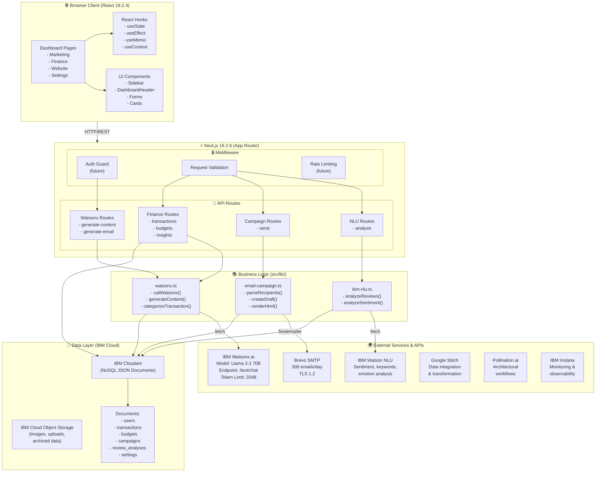

# SmallBox — Architecture & Implementation Details

**Version:** 1.0  
**Last Updated:** May 9, 2026  
**Status:** Production-Ready (v1 MVP)

---

## 1. Overview

SmallBox is a **full-stack web application** that brings enterprise-grade AI tools to small business owners. This document provides detailed technical implementation details, API contracts, database schema, and deployment architecture.

### Core Components

1. **Frontend**: React 19.2.4 + TypeScript + Next.js 16.2.6 (App Router)
2. **Backend**: Next.js API Routes (serverless Node.js functions)
3. **Data Store**: IBM Cloudant (NoSQL JSON documents) for persistent data
4. **AI & NLU**: IBM Watsonx.ai, IBM Watson NLU
5. **External Services**: Brevo SMTP, Google Stitch, Pollination.ai
6. **Monitoring & Storage**: IBM Instana, IBM Cloud Object Storage
7. **UI Framework**: Tailwind CSS + Framer Motion + Three.js
8. **Utilities**: Tesseract.js (OCR), Nodemailer, Recharts

### Key Principles

- **Privacy First**: All credentials server-side only; no keys sent to browser
- **Graceful Degradation**: Fallback templates when external APIs unavailable
- **Type-Safe**: Full TypeScript across frontend and backend
- **Separation**: Frontend (UI/UX) ↔ Backend (Logic) ↔ External APIs (Intelligence)

---

## 2. System Architecture Diagram (Detailed)



---

## 2.5 Complete Technology Stack

SmallBox integrates **9+ enterprise-grade services** from IBM Cloud, Google, and specialized vendors:

### Cloud Infrastructure & Data (IBM Cloud)

| Service | Purpose | Feature |
|---------|---------|---------|
| **IBM Cloudant** | NoSQL Database | Distributed JSON document storage; automatic replication; built-in search/analytics |
| **IBM Cloud Object Storage** | File Storage | Scalable object storage for images, documents, archived data; S3-compatible API |
| **IBM Instana** | Application Monitoring | Real-time performance monitoring, error tracking, dependency mapping, auto-scaling insights |

### AI & Intelligence (IBM Cloud)

| Service | Purpose | Feature |
|---------|---------|---------|
| **IBM Watsonx.ai** | Generative AI | Meta Llama 3.3 70B Instruct model; content generation + auto-categorization; /text/chat endpoint (2048 token limit) |
| **IBM Watson NLU** | Natural Language Understanding | Sentiment analysis, emotion detection, keyword extraction, entity recognition |

### External Integrations

| Service | Purpose | Feature |
|---------|---------|---------|
| **Brevo SMTP** | Email Delivery | Reliable transactional email; 300/day free tier; verified sender support; TLS 1.2 security |
| **Google Stitch** | Data Integration | ETL workflows; transform and sync data between sources; schedule jobs |
| **Pollination.ai** | Architectural Intelligence | Design automation workflows; parametric modeling (v2 planned for website builder) |

### Frontend Stack

| Technology | Version | Purpose |
|-----------|---------|---------|
| React | 19.2.4 | Component-based UI framework |
| Next.js | 16.2.6 | Full-stack framework with App Router, API routes |
| TypeScript | 5.x | Type-safe JavaScript |
| Tailwind CSS | 4.0 | Utility-first CSS framework |
| Framer Motion | 12.38.0 | Animation library for smooth transitions |
| Three.js + React Three Fiber | Latest | 3D graphics rendering |
| Recharts | 3.8.1 | React charting library for finance dashboard |
| Lucide React | 1.14.0 | Icon library |

### Utilities & Libraries

| Library | Version | Purpose |
|---------|---------|---------|
| Nodemailer | 8.0.7 | SMTP client for email handling |
| Tesseract.js | 7.0.0 | OCR for receipt/document scanning |
| Vite | Latest | Fast build tool for frontend |
| Shadcn/ui | Latest | Component library (form inputs, cards, etc.) |
| Zod | Latest | Schema validation (TypeScript) |

### Development Tools

| Tool | Purpose |
|------|---------|
| ESLint | Code linting & quality |
| PostCSS | CSS preprocessing for Tailwind |
| Docker | Containerization (production deployment) |
| Git | Version control |

---

### Service Responsibilities

**IBM Cloud Trio (Data + Monitoring):**
- **Cloudant**: Persistent storage (ACID transactions, real-time replication)
- **Cloud Object Storage**: Media & files (images, receipts, archived exports)
- **Instana**: System health, performance bottlenecks, error aggregation

**IBM Watsonx Duo (Intelligence):**
- **Watsonx.ai**: Content generation, finance categorization, prompt-based tasks
- **Watson NLU**: Review analysis, sentiment scoring, keyword extraction

**External Connectors:**
- **Brevo**: Email campaigns at scale (SMTP relay + delivery guarantees)
- **Google Stitch**: Data pipelines (sync external data sources)
- **Pollination.ai**: Parametric design workflows (future website builder)

---

## 3. API Contracts & Endpoints

### 3.1 Watsonx Content Generation

**Endpoint**: `POST /api/ibm/watsonx/generate-content`

**Request**:
```typescript
interface GenerateContentRequest {
  topic: string                      // "New summer collection launch"
  tone: "professional" | "friendly" | "bold"
  platform: "instagram" | "facebook" | "email" | "ad"
  audience?: string                  // Optional context
  maxTokens?: number                 // Default: 350
}
```

**Response**:
```typescript
interface GenerateContentResponse {
  variations: string[]               // Array of 3 unique variations
  source: "watsonx" | "local"       // Whether AI or fallback
  generatedAt: string               // ISO timestamp
  model?: string                    // "llama-3.3-70b-instruct"
  error?: string                    // If source is "local", why
  tokensUsed?: number
}

// Example
{
  "variations": [
    "This summer, discover our exclusive new collection... Shop now!",
    "Ready to refresh your wardrobe? Our latest designs are here...",
    "Limited time: 20% off our fresh summer lineup. Grab yours today!"
  ],
  "source": "watsonx",
  "generatedAt": "2026-05-09T15:30:00Z",
  "model": "llama-3.3-70b-instruct",
  "tokensUsed": 45
}
```

### 3.2 Watsonx Email Generation

**Endpoint**: `POST /api/ibm/watsonx/generate-email`

**Request**:
```typescript
interface GenerateEmailRequest {
  businessName: string               // "Acme Corp"
  audience: string                   // "B2B SaaS customers"
  template: "promotional" | "newsletter" | "announcement"
  tone: "professional" | "friendly" | "bold"
  offer: string                      // "20% off annual plans"
}
```

**Response**:
```typescript
interface GenerateEmailResponse {
  draft: EmailDraft
  source: "watsonx" | "local"
  generatedAt: string
  watsonxError?: string
}

interface EmailDraft {
  subject: string                    // < 60 chars
  preheader: string                  // < 80 chars
  body: string                       // < 400 chars
  ctaLabel: string                   // e.g., "Claim Offer"
  ctaUrl: string                     // e.g., "https://example.com/offer"
}
```

### 3.3 Email Campaign Send

**Endpoint**: `POST /api/campaigns/send`

**Request**:
```typescript
interface SendCampaignRequest {
  recipients: string[]               // Valid email addresses
  draft: EmailDraft
  campaignName?: string
  scheduledFor?: string              // ISO timestamp (future: scheduled send)
}
```

**Response**:
```typescript
interface SendCampaignResponse {
  campaignId: string
  acceptedCount: number
  rejectedRecipients: {
    email: string
    reason: string                  // "invalid format", "SMTP error", etc.
  }[]
  sentAt: string
  estimatedDeliveryTime: string
}
```

### 3.4 Watson NLU Sentiment Analysis

**Endpoint**: `POST /api/ibm/nlu/analyze`

**Request**:
```typescript
interface AnalyzeRequest {
  reviews: string[]                  // Array of review texts
  language?: string                  // Default: "en"
}
```

**Response**:
```typescript
interface AnalyzeResponse {
  overallSentiment: {
    label: "positive" | "negative" | "neutral"
    score: number                    // 0-1.0 (0 = negative, 1 = positive)
  }
  topPositiveThemes: string[]
  topNegativeThemes: string[]
  keywords: {
    text: string
    relevance: number                // 0-1.0
    sentiment: "positive" | "negative" | "neutral"
  }[]
  emotionalTones: {
    emotion: "joy" | "fear" | "sadness" | "disgust" | "anger"
    score: number
  }[]
  recommendations: string[]          // AI-generated improvements
  analyzedAt: string
}
```

### 3.5 Finance Endpoints

**List Transactions**:
```
GET /api/finance/transactions?month=2026-05&category=Food
```

**Create Transaction**:
```typescript
POST /api/finance/transactions
{
  amount: number
  description: string
  date: string                       // ISO date
  category?: string                  // Optional; can auto-categorize
  note?: string
}
```

**Auto-Categorize**:
```
POST /api/finance/categorize
{
  description: "Whole Foods grocery",
  amount: 49.99
}
// Returns: { category: "Food", confidence: 0.95 }
```

**Get Insights**:
```
GET /api/finance/insights?month=2026-05
// Returns: { totalIncome, totalExpense, byCategory, alerts, recommendations }
```

---

## 4. Database Schema (IBM Cloudant)

IBM Cloudant stores all data as **JSON documents** in collections/databases. No SQL required; documents are flexible and schema-less.

### Document Collections

#### Users Collection
```json
{
  "_id": "user_abc123",
  "_rev": "1-5a76de4d9b8f4e3c9d2e1f0",
  "type": "user",
  "email": "owner@business.com",
  "businessName": "Acme Corp",
  "tier": "free",
  "createdAt": "2026-05-09T10:00:00Z",
  "settings": {
    "theme": "dark",
    "emailNotifications": true,
    "language": "en"
  }
}
```

#### Transactions Collection
```json
{
  "_id": "txn_abc123",
  "_rev": "1-7c8d9e0f1a2b3c4d5e6f",
  "type": "transaction",
  "userId": "user_abc123",
  "amount": -49.99,
  "description": "Whole Foods grocery",
  "category": "Food",
  "date": "2026-05-09",
  "note": "Weekly groceries",
  "source": "watsonx",
  "tags": ["food", "grocery"],
  "createdAt": "2026-05-09T15:30:00Z",
  "updatedAt": "2026-05-09T15:30:00Z"
}
```

#### Budgets Collection
```json
{
  "_id": "budget_abc123",
  "_rev": "1-9h0i1j2k3l4m5n6o",
  "type": "budget",
  "userId": "user_abc123",
  "category": "Food",
  "month": "2026-05",
  "targetAmount": 400,
  "alertThreshold": 0.9,
  "spent": 245.50,
  "createdAt": "2026-05-01T00:00:00Z",
  "updatedAt": "2026-05-09T15:30:00Z"
}
```

#### Campaigns Collection
```json
{
  "_id": "camp_abc123",
  "_rev": "1-1p2q3r4s5t6u7v8w",
  "type": "campaign",
  "userId": "user_abc123",
  "campaignName": "Summer Sale",
  "recipientsCount": 150,
  "draft": {
    "subject": "Summer Sale: 40% Off",
    "preheader": "Limited time offer",
    "body": "Discover our exclusive summer collection...",
    "ctaLabel": "Shop Now",
    "ctaUrl": "https://shop.example.com"
  },
  "sentCount": 150,
  "rejectedCount": 0,
  "source": "watsonx",
  "sentAt": "2026-05-09T16:00:00Z",
  "createdAt": "2026-05-09T15:30:00Z"
}
```

#### Review Analyses Collection
```json
{
  "_id": "review_abc123",
  "_rev": "1-2x3y4z5a6b7c8d9e",
  "type": "review_analysis",
  "userId": "user_abc123",
  "reviews": ["Great product!", "Fast shipping", "10/10 experience"],
  "overallSentiment": {
    "label": "positive",
    "score": 0.92
  },
  "topPositiveThemes": ["Quality", "Fast delivery", "Great service"],
  "topNegativeThemes": [],
  "keywords": [
    { "text": "quality", "relevance": 0.95, "sentiment": "positive" },
    { "text": "fast", "relevance": 0.88, "sentiment": "positive" }
  ],
  "emotionalTones": [
    { "emotion": "joy", "score": 0.85 }
  ],
  "recommendations": ["Continue focus on quality", "Maintain delivery speed"],
  "analyzedAt": "2026-05-09T17:00:00Z",
  "createdAt": "2026-05-09T17:00:00Z"
}
```

#### Settings Collection
```json
{
  "_id": "settings_user_abc123",
  "_rev": "1-3c4d5e6f7g8h9i0j",
  "type": "settings",
  "userId": "user_abc123",
  "theme": "dark",
  "emailNotifications": true,
  "aiPreferences": {
    "contentTone": "professional",
    "marketingPlatform": "instagram",
    "autoCategorizationEnabled": true
  },
  "createdAt": "2026-05-01T00:00:00Z",
  "updatedAt": "2026-05-09T10:00:00Z"
}
```

### Cloudant Indexes

Cloudant automatically creates indexes for:
- `_id` (unique document ID)
- `type` (document type: user, transaction, campaign, etc.)
- `userId` (for user-scoped queries)
- `date` (for transactions sorted by date)
- `category` (for budget/transaction filtering)

**Custom Indexes (via Cloudant query):**
```javascript
// Index for user transactions by date
{
  "index": {
    "fields": ["userId", "date"]
  },
  "type": "json"
}

// Index for budgets by month
{
  "index": {
    "fields": ["userId", "month"]
  },
  "type": "json"
}
```

### Data Relationships (NoSQL)

```
User Document (1)
  ├── (N) Transaction Documents (linked via userId)
  ├── (N) Budget Documents (linked via userId)
  ├── (N) Campaign Documents (linked via userId)
  ├── (N) Review Analysis Documents (linked via userId)
  └── (1) Settings Document (1:1 relationship)
```

### Storage Locations

| Data Type | Storage | Service |
|-----------|---------|---------|
| **Hot Data** (active transactions, campaigns, budgets) | IBM Cloudant | Real-time queries, replication |
| **Media** (receipt images, logos, uploaded documents) | IBM Cloud Object Storage | Scalable, S3-compatible |
| **Archived Data** (old transactions, historical exports) | Cloud Object Storage (Cloudant + S3 lifecycle) | Cold storage for compliance |

---

## 5. Environment Variables & Secrets

All secrets stored in `.env.local` (git-ignored). **Never commit `.env.local`**.

### Required Variables

```env
# === IBM Watsonx.ai (Content Generation) ===
# Get from: https://dataplatform.cloud.ibm.com/wx
WATSONX_API_KEY=<32-char API key>
WATSONX_PROJECT_ID=<UUID>
WATSONX_URL=https://ca-tor.ml.cloud.ibm.com/ml/v1

# === IBM Watson NLU (Sentiment Analysis) ===
# Get from: IBM Cloud Console → Watson NLU instance
IBM_NLU_API_KEY=<API key>
IBM_NLU_URL=https://api.us-south.natural-language-understanding.watson.cloud.ibm.com
IBM_NLU_VERSION=2021-08-01

# === IBM Cloudant (NoSQL Database) ===
# Get from: IBM Cloud Console → Cloudant instance
CLOUDANT_API_KEY=<API key>
CLOUDANT_URL=https://<username>:<password>@<account>.cloudant.com
CLOUDANT_DATABASE=smallbox

# === IBM Cloud Object Storage (File Storage) ===
# Get from: IBM Cloud Console → Object Storage instance
COS_API_KEY=<Service credential API key>
COS_ENDPOINT=https://<region>.s3.<region>.cloud-object-storage.appdomain.cloud
COS_BUCKET_NAME=smallbox-media
COS_IBM_AUTH_ENDPOINT=https://iam.cloud.ibm.com/identity/token

# === IBM Instana (Monitoring & Observability) ===
# Get from: IBM Instana console
INSTANA_AGENT_KEY=<Agent key for serverless>
INSTANA_ENDPOINT_URL=https://<tenant>-pink.instana.io

# === Email (Brevo SMTP) ===
# Get from: https://app.brevo.com → Settings → SMTP & API
SMTP_HOST=smtp-relay.brevo.com
SMTP_PORT=587
SMTP_SECURE=true
SMTP_USER=<email or login>
SMTP_PASS=<SMTP password>
SMTP_FROM_EMAIL=<verified sender email>

# === Google Stitch (Data Integration) ===
# Get from: Google Cloud Console → Stitch setup
GOOGLE_STITCH_CLIENT_ID=<OAuth Client ID>
GOOGLE_STITCH_CLIENT_SECRET=<OAuth Client Secret>
GOOGLE_STITCH_PROJECT_ID=<GCP Project ID>

# === Pollination.ai (Architectural Workflows) ===
# Get from: Pollination dashboard
POLLINATION_API_KEY=<API key>
POLLINATION_ACCOUNT_ID=<Account ID>

# === Application ===
NODE_ENV=development
NEXT_PUBLIC_API_URL=http://localhost:3000
DATABASE_PATH=./smallbox.db
```

### Optional Variables (v2 Planning)

```env
# Website Builder (future)
IBM_CD_API_KEY=<for CI/CD pipeline>

# Advanced Features (future)
JWT_SECRET=<for API auth>
CORS_ORIGIN=https://example.com
RATE_LIMIT_ENABLED=true
```

---

## 6. Request/Response Flow Examples

### Example 1: Generate Marketing Content

```
User Action: Marketing Dashboard → AI Content Tab → Topic: "Summer Sale" → Platform: "Instagram"

1. Frontend (React)
   └─> POST /api/ibm/watsonx/generate-content
       {
         "topic": "Summer sale",
         "tone": "bold",
         "platform": "instagram"
       }

2. Backend (Next.js)
   └─> API Route validates input
   └─> Calls src/lib/watsonx.ts → generateContentWithWatsonx()
       └─> Builds detailed prompt with examples
       └─> Calls IBM Watsonx.ai API
           ├─ Success: Extract 3 variations from response
           ├─ Timeout: Fall back to local templates
           └─ Error: Return source: "local" with fallback content

3. Response
   {
     "variations": [
       "☀️ Summer Glow-Up: Our hottest collection is HERE. Limited time, max 40% off. Shop now! 🛍️",
       "Beat the heat with our NEW summer essentials. Freshly arrived, already flying off shelves 🔥",
       "Your summer wardrobe isn't complete without these pieces. Flash sale starts TODAY ⏰"
     ],
     "source": "watsonx",
     "generatedAt": "2026-05-09T15:30:00Z",
     "tokensUsed": 52
   }

4. Frontend displays 3 variations in editable text areas
   └─> User selects one, copies to clipboard, or clicks "Share"
```

### Example 2: Auto-Categorize Expense

```
User Action: Finance Dashboard → Add Expense → "Whole Foods" $49.99

1. Frontend
   └─> Calls categorizeTransaction() helper
   └─> POST /api/finance/categorize
       {
         "description": "Whole Foods",
         "amount": 49.99
       }

2. Backend
   └─> Calls src/lib/watsonx.ts → categorizeTransaction()
       └─> Sends to Watsonx: "Categorize: Whole Foods $49.99. Categories: Food, Rent, Utilities, Supplies, Other."
       └─> Parses response, validates category
       └─ If error: Returns "Other" as safe default

3. Response
   {
     "category": "Food",
     "confidence": 0.98,
     "source": "watsonx"
   }

4. Frontend displays category with override option
   └─> User confirms or changes
   └─> Saves to IBM Cloudant with category
```

### Example 3: Send Email Campaign

```
User Action: Marketing → Email Campaigns → "Ready to send?"

1. Frontend
   └─> Calls parseEmailRecipients(emailList)
   └─> Validates emails, deduplicates
   └─> User reviews draft (subject, body, CTA)
   └─> Clicks "Send Campaign"

2. Frontend
   └─> POST /api/campaigns/send
       {
         "recipients": ["alice@example.com", "bob@example.com"],
         "draft": {
           "subject": "Summer Sale: 40% Off",
           "preheader": "Limited time offer",
           "body": "...",
           "ctaLabel": "Shop Now",
           "ctaUrl": "https://shop.example.com"
         }
       }

3. Backend
   └─> Calls src/lib/email-campaign.ts → renderEmailCampaignHtml()
   └─> Creates Nodemailer transport (Brevo)
   └─> For each recipient:
       ├─ Renders personalized HTML email
       ├─ Sends via SMTP
       └─ Tracks accept/reject

4. Response
   {
     "campaignId": "camp_abc123",
     "acceptedCount": 2,
     "rejectedRecipients": [],
     "sentAt": "2026-05-09T15:35:00Z"
   }

5. Backend stores campaign in IBM Cloudant
   └─> Frontend displays success message
```

---

## 7. Error Handling & Fallbacks

### Watsonx.ai Fallback Logic

```typescript
try {
  // Attempt to call Watsonx
  const response = await callWatsonx(prompt, maxTokens);
  return {
    content: parseResponse(response),
    source: "watsonx"
  };
} catch (error) {
  // Fallback to local templates
  console.warn(`Watsonx failed: ${error.message}`);
  return {
    content: generateLocalTemplate(input),
    source: "local",
    error: error.message
  };
}
```

### Common Error Scenarios

| Scenario | Status | Action | User Sees |
|----------|--------|--------|-----------|
| Missing env vars | 500 | Use local template | "Generated locally" badge |
| API timeout (>20s) | 503 | Fallback immediately | "Local version (faster)" |
| Auth error (401) | 401 | Check credentials, fallback | Error alert + suggestion |
| Malformed JSON | 422 | Log and fallback | Fallback content |
| SMTP delivery fail | 202 | Queue for retry | "Sent to queue" message |
| Invalid email list | 400 | Return with error details | List of invalid emails |

---

## 8. Performance Optimizations (Implemented)

### 1. Global Animation Reduction (50%)
- Reduced background beam count: 30 → 15
- Added `prefers-reduced-motion` media query
- Pause animation on `visibilitychange` (tab switch)
- Result: 50% less canvas rendering work

### 2. Marketing Page Memoization
```typescript
const parsedRecipients = useMemo(
  () => parseEmailRecipients(emailRecipients),
  [emailRecipients]
);

const draftPreview = useMemo(
  () => createEmailCampaignDraft({...}),
  [emailTemplate, emailTone, emailBusinessName, emailAudience, emailOffer]
);
```
- Prevents re-parsing during form input
- Re-calculates only when dependencies change

### 3. Dashboard Shell Optimization
- Replaced Framer Motion with CSS transitions
- Lazy-load WatsonChat (mounted only on user interaction)
- Result: Faster initial dashboard load

### Further Optimizations (Future)
- [ ] Code splitting for dashboard pages
- [ ] Image optimization (Next.js Image)
- [ ] Database query optimization + caching
- [ ] API response compression
- [ ] Client-side caching (localStorage for form state)

---

## 9. Security Architecture

### Data Flow Security

```
┌─────────────┐
│   Browser   │  ← User cannot see API keys
└─────────────┘
       ↓ (HTTPS only)
┌─────────────────────────────────────┐
│  Next.js API Routes (Node.js)       │
│  - Validates requests               │
│  - Loads secrets from .env.local    │
│  - Makes external API calls         │
└─────────────────────────────────────┘
       ↓ (HTTPS + Auth headers)
┌──────────────────────────────────────┐
│  External APIs (Watsonx, NLU, etc)  │
│  - Authentication: IAM tokens, API  │
│  - Never shared with browser        │
└──────────────────────────────────────┘
```

### Secrets Management

- **Where**: `.env.local` (git-ignored, never committed)
- **When Loaded**: On API route handler execution
- **Scope**: Server-side only; not serialized to client
- **Rotation**: Manual (update .env.local, restart server)
- **Future**: Use AWS Secrets Manager, HashiCorp Vault, or similar

### CORS & HTTPS

- **Development**: Allow localhost (configured in Next.js)
- **Production**: 
  - HTTPS required (TLS 1.2+)
  - Configure CORS origin to match frontend domain
  - Implement CSRF tokens for state-changing requests

### Rate Limiting (Future)

- Per-user API rate limits (prevent abuse)
- Per-endpoint throttling (e.g., 10 generate-content calls/min)
- Implement using middleware or Redis

---

## 10. Deployment Architecture

### Development

```
npm run dev
↓
Next.js dev server (http://localhost:3000)
- Hot module reloading
- Fast refresh
- API routes available at /api
```

### Production

```
Option 1: Vercel (Recommended for Next.js)
- Push to git repo (GitHub)
- Vercel auto-deploys
- Environment variables set in Vercel dashboard
- Serverless functions for API routes
- CDN for static assets

Option 2: IBM Cloud
- Containerize with Docker
- Deploy to IBM Cloud Foundry or Kubernetes
- Set environment variables
- Configure HTTPS + domain

Option 3: Self-Hosted (VPS)
- npm run build
- npm run start
- Run behind reverse proxy (Nginx)
- Configure HTTPS (Let's Encrypt)
```

### Environment Configuration (Production)

```bash
# .env.local (production server)
NODE_ENV=production
NEXT_PUBLIC_API_URL=https://smallbox.app

WATSONX_API_KEY=<production key>
WATSONX_PROJECT_ID=<production ID>
# ... etc

# Database: IBM Cloudant (managed NoSQL)
# Alternative: IBM Db2 for SQL-like features
DATABASE_PATH=/var/data/smallbox.db
```

---

## 11. Monitoring & Observability

### Logging

- **Frontend**: Browser console logs (filtered in prod)
- **Backend**: 
  - API route entry/exit logs
  - External API call logs (with timing)
  - Error logs (with full stack traces)
  - Audit logs (campaigns sent, transactions created)

### Health Check

```
GET /api/health
↓
{
  "status": "healthy",
  "timestamp": "2026-05-09T15:30:00Z",
  "dependencies": {
    "watsonx": "connected",
    "nlu": "connected",
    "smtp": "connected",
    "database": "connected"
  }
}
```

### Error Tracking (Future)

- Integration with Sentry or LogRocket
- Error aggregation + alerting
- Performance monitoring (page load time, API latency)

---

## 12. Testing Strategy

### Unit Tests (Future)

```typescript
// src/lib/watsonx.test.ts
describe("generateContentWithWatsonx", () => {
  it("should return 3 variations", async () => {
    const result = await generateContentWithWatsonx({...});
    expect(result.variations).toHaveLength(3);
    expect(result.source).toBe("watsonx");
  });

  it("should fallback to local on timeout", async () => {
    // Mock Watsonx timeout
    const result = await generateContentWithWatsonx({...});
    expect(result.source).toBe("local");
  });
});
```

### Integration Tests (Future)

- API endpoint tests (mock external APIs)
- Database tests (Cloudant Lite tier or local emulator)
- End-to-end tests (Cypress or Playwright)

### Manual Testing Checklist

- [ ] Generate content in all 4 platforms (Instagram, Facebook, Email, Ad)
- [ ] Auto-categorize transactions (various descriptions)
- [ ] Send email campaign (validate delivery)
- [ ] Analyze customer reviews (sentiment extraction)
- [ ] Test fallback when APIs down
- [ ] Verify database persistence (restart server, data still there)

---

## 13. Roadmap & Future Enhancements

### Phase 2 (Q2 2026)

- [ ] Website Builder: Guided wizard + auto-deploy
- [ ] Multi-user support (teams, permissions)
- [ ] Advanced analytics (forecasting, trends)
- [ ] Receipt scanner (Tesseract.js OCR)

### Phase 3 (Q3 2026)

- [ ] Mobile app (React Native or PWA)
- [ ] Unified AI Assistant (chat-based)
- [ ] Inventory management
- [ ] Social media integrations (auto-post)

### Phase 4 (Q4 2026+)

- [ ] Accounting integrations (QuickBooks, Xero)
- [ ] RPA workflows (automated tasks)
- [ ] Advanced forecasting (ML models)

---

## 14. Support & Troubleshooting

### Common Issues

**Q: Watsonx API returns 401 (Unauthorized)**
- Check `WATSONX_API_KEY` is correct
- Verify `WATSONX_PROJECT_ID` matches your project
- Check token expiration (regenerate in dashboard if needed)

**Q: Email not sending (SMTP error)**
- Verify sender email is "verified" in Brevo
- Check `SMTP_USER` / `SMTP_PASS` are correct
- Verify you haven't exceeded 300/day limit

**Q: Content generation is slow**
- Watsonx.ai can take 15-20s per request
- Check network latency (use API health check)
- Fallback to local templates if consistently slow

**Q: Document conflicts (Cloudant MVCC)**
- Cloudant uses Multi-Version Concurrency Control (MVCC)
- Consider PostgreSQL for production
- Implement write queuing if needed

---

## 15. Contact & Support

- **Issues**: File on GitHub with detailed reproduction steps
- **Security**: Email security@smallbox.app (don't use public issues)
- **Contributing**: Submit PRs with TypeScript + tests
- **Community**: Discord server (link in repo)

---

**Built with ❤️ by the SmallBox team**  
Powered by IBM Cloud technologies
