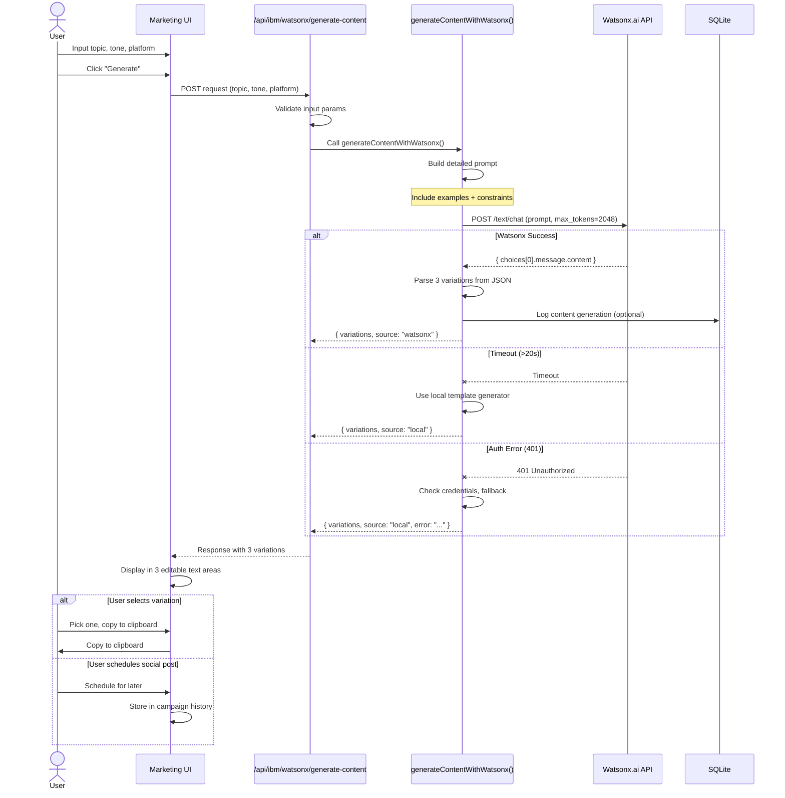
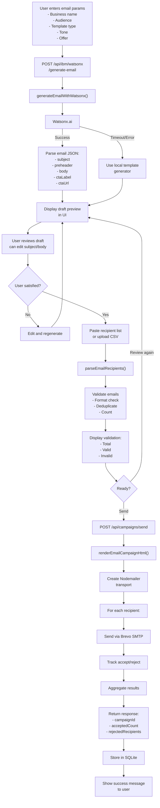
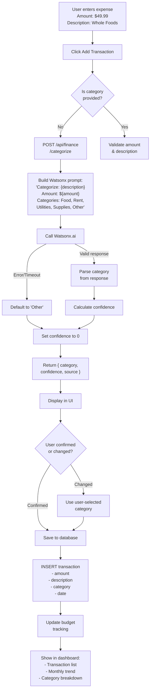
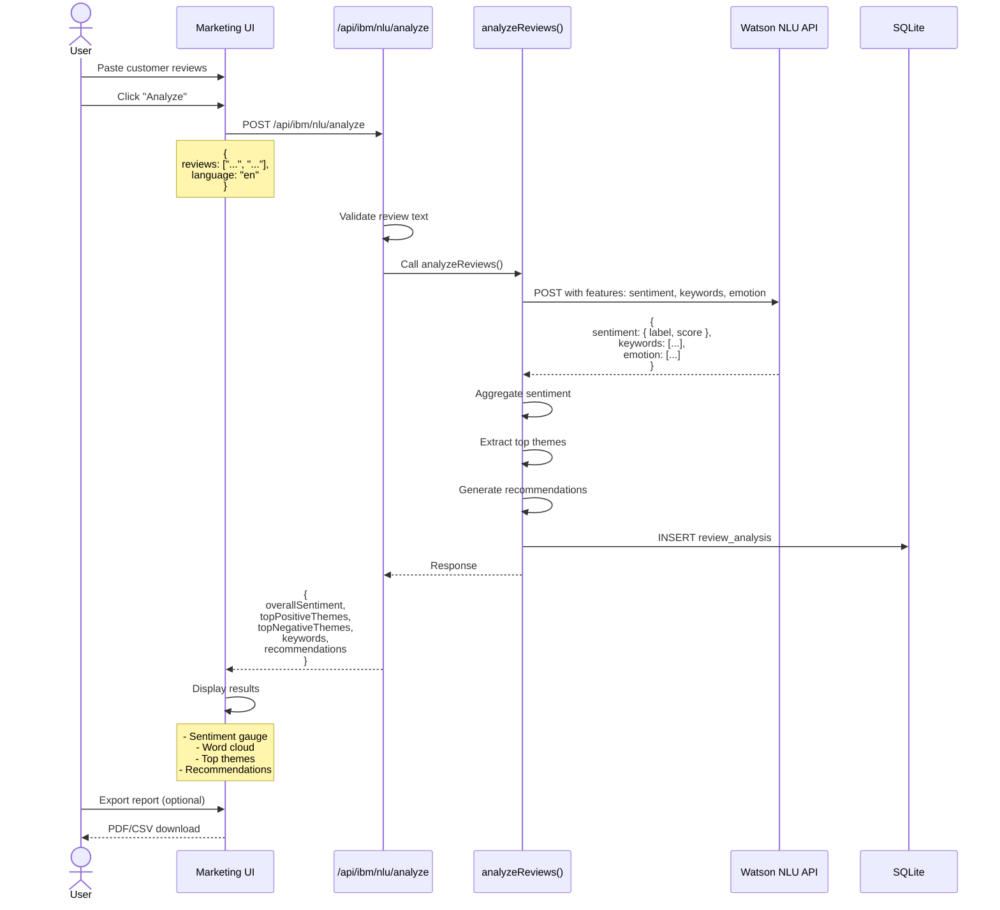
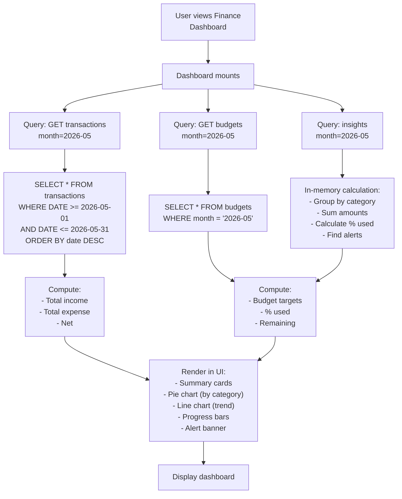
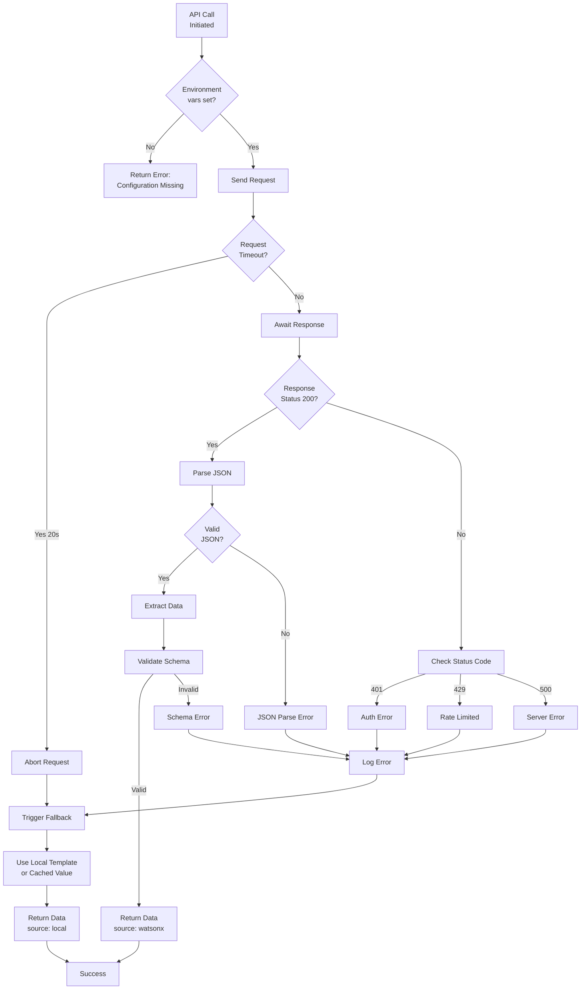

# SmallBox — Data Flow & Feature Pipelines

**Version:** 1.0  
**Last Updated:** May 9, 2026

---

## 1. Marketing Content Generation Pipeline

The **AI Content Generator** turns business topics into social media copy.

### Sequence Diagram



### Data Structure

```typescript
interface GenerateContentRequest {
  topic: string                      // "Summer collection launch"
  tone: "professional" | "friendly" | "bold"
  platform: "instagram" | "facebook" | "email" | "ad"
  audience?: string                  // Optional
}

interface ContentVariation {
  text: string
  platform: string
  characterCount: number
  hashtags?: string[]                // For Instagram
}

interface GenerateContentResponse {
  variations: ContentVariation[]     // Always 3
  source: "watsonx" | "local"
  generatedAt: string
  model?: string
  error?: string
}
```

### Watsonx.ai Prompt Engineering

**Prompt Structure:**
```
System: "You are an expert social media copywriter..."

Task: Generate {platform} content for:
  - Topic: "{topic}"
  - Target audience: "{audience}"
  - Tone: "{tone}"

Examples:
  [3 high-quality examples per platform]

Requirements:
  - Generate EXACTLY 3 unique variations
  - Tone: "{tone}"
  - For {platform}: [platform-specific constraints]
  - Output: Valid JSON with "variations" array

OUTPUT FORMAT (MUST BE VALID JSON):
{
  "variations": [
    { "text": "...", "hashtags": [...] },
    { "text": "...", "hashtags": [...] },
    { "text": "...", "hashtags": [...] }
  ]
}
```

---

## 2. Email Campaign Pipeline

The **Email Campaign Builder** combines content generation + SMTP delivery.

### Complete Flow Diagram



### Email Draft Structure

```typescript
interface EmailCampaignDraft {
  subject: string                    // Max 60 chars
  preheader: string                  // Max 80 chars (preview text)
  body: string                       // Max 400 chars
  ctaLabel: string                   // Max 4 words
  ctaUrl: string                     // Full URL
}

// HTML Rendering
function renderEmailCampaignHtml(draft: EmailCampaignDraft): string {
  return `
    <!DOCTYPE html>
    <html>
      <head>
        <meta charset="utf-8">
        <title>${draft.subject}</title>
      </head>
      <body>
        <table>
          <tr>
            <td>
              <h1>${escapeHtml(draft.subject)}</h1>
              <p>${escapeHtml(draft.body)}</p>
              <a href="${draft.ctaUrl}" style="...">
                ${escapeHtml(draft.ctaLabel)}
              </a>
            </td>
          </tr>
        </table>
      </body>
    </html>
  `;
}
```

### Recipient Parsing

```typescript
function parseEmailRecipients(emailList: string): {
  valid: string[]
  invalid: { email: string; reason: string }[]
  duplicates: number
} {
  // 1. Split by newlines, commas, semicolons
  let emails = emailList.split(/[\n,;]/).map(e => e.trim());
  
  // 2. Validate format
  const validPattern = /^[^\s@]+@[^\s@]+\.[^\s@]+$/;
  
  // 3. Deduplicate
  const seen = new Set<string>();
  let duplicates = 0;
  
  return emails.reduce((acc, email) => {
    if (seen.has(email)) {
      duplicates++;
      return acc;
    }
    
    if (validPattern.test(email)) {
      seen.add(email);
      acc.valid.push(email);
    } else {
      acc.invalid.push({ email, reason: "Invalid format" });
    }
    
    return acc;
  }, {
    valid: [],
    invalid: [],
    duplicates
  });
}
```

### SMTP Delivery (Brevo)

```typescript
// src/lib/email-campaign.ts
async function sendEmailCampaign(
  recipients: string[],
  draft: EmailCampaignDraft
) {
  const transporter = nodemailer.createTransport({
    host: process.env.SMTP_HOST,
    port: process.env.SMTP_PORT,
    secure: process.env.SMTP_SECURE === 'true',
    auth: {
      user: process.env.SMTP_USER,
      pass: process.env.SMTP_PASS,
    },
  });
  
  const htmlBody = renderEmailCampaignHtml(draft);
  const accepted: string[] = [];
  const rejected: { email: string; reason: string }[] = [];
  
  for (const recipient of recipients) {
    try {
      const info = await transporter.sendMail({
        from: process.env.SMTP_FROM_EMAIL,
        to: recipient,
        subject: draft.subject,
        html: htmlBody,
        // Optional: Add tracking pixel
        // html: htmlBody + ``
      });
      
      accepted.push(recipient);
      console.log(`Email sent to ${recipient}: ${info.messageId}`);
    } catch (error) {
      rejected.push({
        email: recipient,
        reason: error.message,
      });
      console.error(`Failed to send to ${recipient}: ${error.message}`);
    }
  }
  
  return {
    acceptedCount: accepted.length,
    rejectedRecipients: rejected,
    sentAt: new Date().toISOString(),
  };
}
```

---

## 3. Finance Auto-Categorization Pipeline

The **Finance Dashboard** auto-categorizes expenses using Watsonx.ai.

### Flow



### Category Mapping

```typescript
// Allowed transaction categories
const TRANSACTION_CATEGORIES = [
  "Food",
  "Rent",
  "Utilities",
  "Supplies",
  "Transportation",
  "Entertainment",
  "Healthcare",
  "Other"
] as const;

async function categorizeTransaction(
  description: string,
  amount: number
): Promise<{
  category: typeof TRANSACTION_CATEGORIES[number]
  confidence: number
  source: "watsonx" | "local" | "heuristic"
}> {
  try {
    const prompt = `
      Categorize this transaction:
      Description: "${description}"
      Amount: $${amount}
      
      Available categories:
      - Food (groceries, restaurants, delivery)
      - Rent (housing, lease)
      - Utilities (electricity, water, internet)
      - Supplies (office, cleaning, household)
      - Transportation (gas, parking, transit)
      - Entertainment (movies, sports, hobbies)
      - Healthcare (medical, pharmacy)
      - Other (miscellaneous)
      
      Respond with ONLY the category name, nothing else.
    `;
    
    const result = await callWatsonx(prompt, maxTokens=50);
    let category = result.trim();
    
    // Validate
    if (!TRANSACTION_CATEGORIES.includes(category)) {
      category = "Other";
    }
    
    return {
      category,
      confidence: 0.95,
      source: "watsonx"
    };
  } catch (error) {
    // Fallback heuristic
    if (description.toLowerCase().includes('grocery') ||
        description.toLowerCase().includes('restaurant')) {
      return {
        category: "Food",
        confidence: 0.7,
        source: "heuristic"
      };
    }
    
    return {
      category: "Other",
      confidence: 0,
      source: "local"
    };
  }
}
```

---

## 4. Customer Review Sentiment Analysis Pipeline

The **Review Analyzer** extracts sentiment and themes from customer feedback.

### Sequence



### Sentiment Analysis Response

```typescript
interface AnalysisResult {
  overallSentiment: {
    label: "positive" | "negative" | "neutral"
    score: number              // 0-1 (0=very negative, 1=very positive)
    percentagePositive: number // 0-100
  }
  
  topPositiveThemes: string[] // ["Quality", "Fast shipping", "Great customer service"]
  topNegativeThemes: string[] // ["Slow delivery", "Damaged item", "Poor quality"]
  
  keywords: Array<{
    text: string
    relevance: number          // 0-1 (importance)
    sentiment: "positive" | "negative" | "neutral"
  }>
  
  emotionalTones: Array<{
    emotion: "joy" | "sadness" | "anger" | "fear" | "disgust"
    score: number              // 0-1
  }>
  
  recommendations: string[]   // AI-generated improvements
  
  reviewCount: number
  analyzedAt: string
}
```

### Watson NLU Integration

```typescript
// src/lib/ibm-nlu.ts
import { NaturalLanguageUnderstandingV1 } from 'ibm-watson/natural-language-understanding/v1.js';
import { IamAuthenticator } from 'ibm-watson/auth/index.js';

const nlu = new NaturalLanguageUnderstandingV1({
  version: process.env.IBM_NLU_VERSION,
  authenticator: new IamAuthenticator({
    apikey: process.env.IBM_NLU_API_KEY,
  }),
  serviceUrl: process.env.IBM_NLU_URL,
});

async function analyzeReviews(reviews: string[]): Promise<AnalysisResult> {
  const combinedText = reviews.join('\n\n');
  
  const analyzeParams = {
    text: combinedText,
    features: {
      sentiment: {},
      keywords: {
        emotion: true,
        sentiment: true,
        limit: 10,
      },
      emotion: {},
    },
    language: 'en',
  };
  
  const result = await nlu.analyze(analyzeParams);
  
  return {
    overallSentiment: {
      label: result.result.sentiment.document.label,
      score: result.result.sentiment.document.score,
      percentagePositive: Math.round(
        (result.result.sentiment.document.score + 1) / 2 * 100
      ),
    },
    topPositiveThemes: extractPositiveThemes(result),
    topNegativeThemes: extractNegativeThemes(result),
    keywords: result.result.keywords.map(k => ({
      text: k.text,
      relevance: k.relevance,
      sentiment: k.sentiment?.label || 'neutral',
    })),
    emotionalTones: result.result.emotion.document.emotion,
    recommendations: generateRecommendations(result),
    reviewCount: reviews.length,
    analyzedAt: new Date().toISOString(),
  };
}
```

---

## 5. Dashboard Data Aggregation

The **Finance Dashboard** aggregates transaction data for visualization.

### Query Flow



### Dashboard Components

```typescript
// src/app/dashboard/finance/page.tsx
export default function FinanceDashboard() {
  const [transactions, setTransactions] = useState([]);
  const [budgets, setBudgets] = useState([]);
  const [currentMonth] = useState(new Date());
  
  useEffect(() => {
    // Fetch transaction data
    fetch(`/api/finance/transactions?month=${formatYearMonth(currentMonth)}`)
      .then(r => r.json())
      .then(data => setTransactions(data));
    
    // Fetch budget data
    fetch(`/api/finance/budgets?month=${formatYearMonth(currentMonth)}`)
      .then(r => r.json())
      .then(data => setBudgets(data));
  }, [currentMonth]);
  
  const summary = useMemo(() => {
    let totalIncome = 0;
    let totalExpense = 0;
    const byCategory = {};
    
    transactions.forEach(t => {
      if (t.amount > 0) totalIncome += t.amount;
      if (t.amount < 0) totalExpense += Math.abs(t.amount);
      
      if (!byCategory[t.category]) {
        byCategory[t.category] = 0;
      }
      byCategory[t.category] += Math.abs(t.amount);
    });
    
    return {
      totalIncome,
      totalExpense,
      net: totalIncome - totalExpense,
      byCategory,
    };
  }, [transactions]);
  
  return (
    <div>
      <SummaryCards summary={summary} />
      <PieChart data={summary.byCategory} />
      <LineChart transactions={transactions} />
      <BudgetProgressBars budgets={budgets} summary={summary} />
      <TransactionList transactions={transactions} />
    </div>
  );
}
```

---

## 6. Error Handling & Fallback Chains

### Decision Tree



---

## 7. Data Persistence Strategy

### Transactions Example

```typescript
// User adds $49.99 "Whole Foods" expense on 2026-05-09

// 1. Frontend prepares data
const newTransaction = {
  amount: -49.99,                    // Negative for expense
  description: "Whole Foods",
  date: "2026-05-09",
  category: undefined,               // Not yet categorized
};

// 2. Auto-categorize (optional)
const categorized = await fetch("/api/finance/categorize", {
  method: "POST",
  body: JSON.stringify({
    description: "Whole Foods",
    amount: -49.99,
  }),
});

newTransaction.category = categorized.category;

// 3. Save to database
const saved = await fetch("/api/finance/transactions", {
  method: "POST",
  body: JSON.stringify(newTransaction),
});

// 4. Backend INSERT
// INSERT INTO transactions (id, user_id, amount, description, category, date, created_at)
// VALUES ('txn_abc123', 'user_123', -49.99, 'Whole Foods', 'Food', '2026-05-09', CURRENT_TIMESTAMP);

// 5. Frontend updates UI
setTransactions([saved, ...transactions]);
```

---

## 8. Caching & Performance Strategy

### Memoization in React

```typescript
// Dashboard Finance Page
export function FinancePage() {
  const [transactions, setTransactions] = useState<Transaction[]>([]);
  const [currentMonth, setCurrentMonth] = useState(new Date());
  
  // Memoize expensive calculations
  const summary = useMemo(() => {
    return aggregateTransactions(transactions);
  }, [transactions]);  // Only recalculate when transactions change
  
  const chartData = useMemo(() => {
    return transformForChart(transactions);
  }, [transactions]);
  
  const alerts = useMemo(() => {
    return generateBudgetAlerts(summary, budgets);
  }, [summary, budgets]);
  
  return (
    <>
      <SummaryCards summary={summary} />
      <Charts data={chartData} />
      <Alerts alerts={alerts} />
    </>
  );
}
```

### Browser Caching

```typescript
// In API routes, set cache headers
export async function GET(req: Request) {
  const data = await fetchTransactions();
  
  return new Response(JSON.stringify(data), {
    headers: {
      'Content-Type': 'application/json',
      'Cache-Control': 'private, max-age=300',  // 5 minutes
    },
  });
}
```

---

**End of Data Flow Documentation**
