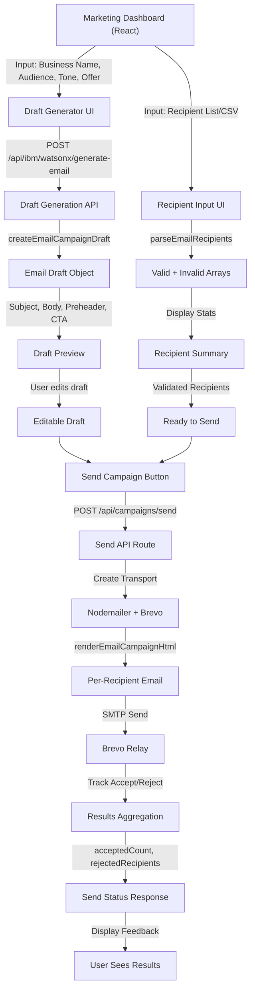
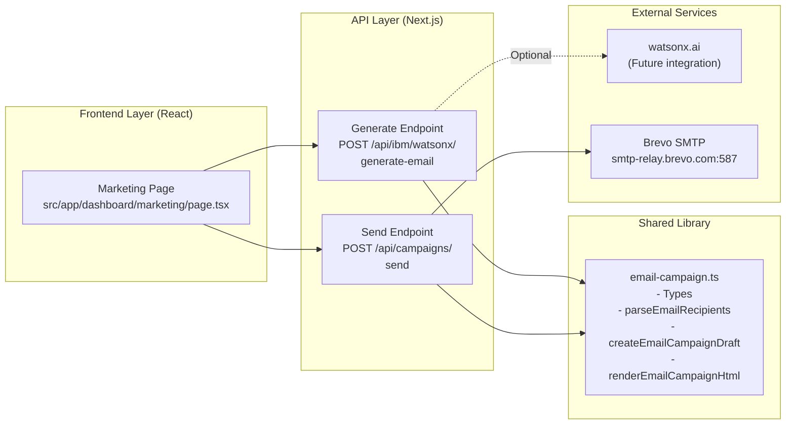
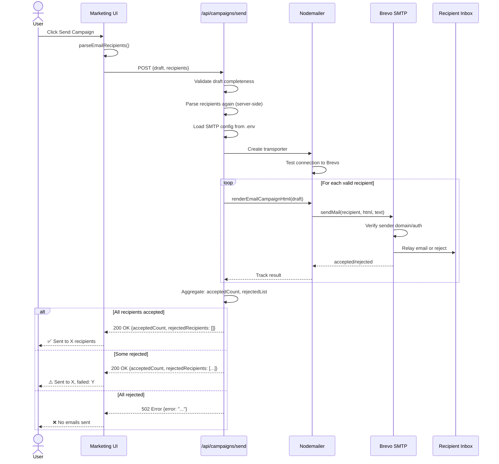
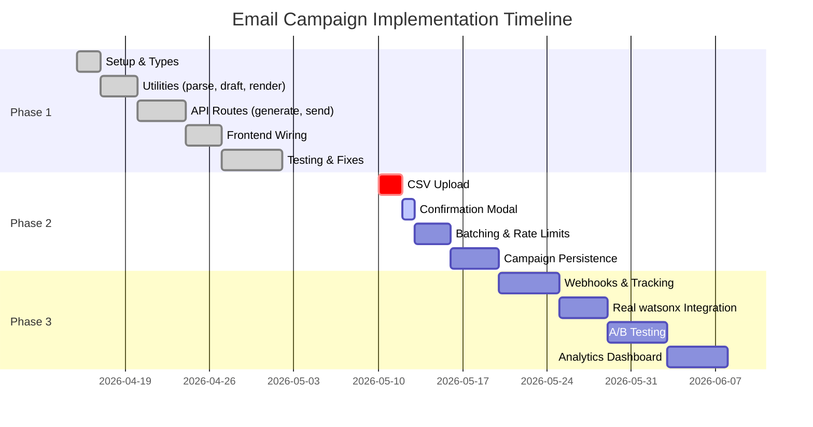

# Email Campaigns & SMTP Setup Plan

**Status:** Implementation Phase 1 Complete | **Last Updated:** May 9, 2026

## Overview

This document outlines the complete SMTP email campaign implementation for the Smallbox Marketing Dashboard. The feature allows users to:
- Generate AI-powered email drafts using watsonx.ai endpoints
- Parse and validate recipient lists (email validation, deduplication)
- Send emails via SMTP provider (currently Brevo)
- Track sent/rejected/invalid recipient counts
- Display real-time feedback and delivery status

---

## Tech Stack

| Component | Technology | Version | Notes |
|-----------|-----------|---------|-------|
| **Email Transport** | Nodemailer | ^8.0.7 | Industry-standard Node.js SMTP client |
| **SMTP Provider** | Brevo (formerly Sendinblue) | N/A | Free tier: 300 emails/day, verified sender required |
| **Server Framework** | Next.js (App Router) | 16.2.6 | Handles API routes in `/api` |
| **Language** | TypeScript | 5.x | Type-safe implementation |
| **Frontend** | React 19.2.4 | Client components for draft generation & sending |

---

## Architecture Overview

### System Flow Diagram



### Component Architecture



### SMTP Send Flow Diagram



---

## SMTP Provider Setup: Brevo

### Prerequisites
1. **Account:** Create free account at [brevo.com](https://brevo.com)
2. **Sender Verification:** Add a verified sender email in Brevo dashboard
   - Must receive confirmation email from Brevo
   - Use this as `SMTP_FROM_EMAIL` in `.env.local`
3. **SMTP Credentials:** Found in **Settings → SMTP & API → SMTP**

### Brevo SMTP Credentials

| Key | Value | Purpose |
|-----|-------|---------|
| Host | `smtp-relay.brevo.com` | Brevo's SMTP relay endpoint |
| Port | `587` | TLS port (TLS required) |
| Secure | `false` | Use STARTTLS (not implicit TLS on 465) |
| Username | `aac721001@smtp-brevo.com` | Brevo sender email for relay |
| Password | See `.env.local` | Generated API key (rotate after exposure) |
| From Email | Verified sender | The email address in your Brevo verified list |

### Free Tier Limits
- **Rate:** 300 emails/day
- **Bulk Sending:** Use provider's bulk endpoint for large campaigns (not per-recipient)
- **Delivery Metrics:** Basic acceptance; bounces require webhook setup for full tracking

---

## Environment Variables

### Required Variables (`.env.local`)

```env
# SMTP Configuration
SMTP_HOST=smtp-relay.brevo.com
SMTP_PORT=587
SMTP_SECURE=false
SMTP_USER=aac721001@smtp-brevo.com
SMTP_PASS=<your-brevo-api-key>
SMTP_FROM_EMAIL=<your-verified-sender@domain.com>

# IBM Watson NLU (existing, required for review analyzer)
IBM_NLU_API_KEY=<key>
IBM_NLU_URL=<url>
IBM_NLU_VERSION=2022-03-30
```

### Notes
- `.env.example` contains placeholders; **never commit secrets to `.env.example`**
- `.env.local` is git-ignored; safe for local secrets
- Server routes read these at **request time** via `process.env.*`
- If variables missing, API returns 500 error

---

## Code Structure

### 1. **Email Campaign Utilities** → `src/lib/email-campaign.ts`

#### Types
```typescript
type EmailCampaignTemplate = "promotional" | "newsletter" | "announcement"
type EmailCampaignTone = "professional" | "friendly" | "bold"

interface EmailCampaignDraft {
  subject: string
  preheader: string
  body: string
  ctaLabel: string
  ctaUrl: string
}

interface ParsedEmailRecipients {
  valid: string[]
  invalid: string[]
}
```

#### Key Functions

| Function | Input | Output | Purpose |
|----------|-------|--------|---------|
| `parseEmailRecipients()` | CSV/newline string | `{ valid, invalid }` | Parse, validate, dedupe emails |
| `createEmailCampaignDraft()` | Template/tone/offer | `EmailCampaignDraft` | Generate structured draft text |
| `renderEmailCampaignHtml()` | Draft + business name | HTML string | Render styled email HTML |

**Recipient Parsing Logic:**
- Accepts delimiters: newline, comma, semicolon
- Validates against regex: `/^[^\s@]+@[^\s@]+\.[^\s@]+$/`
- **Deduplicates** case-insensitively
- Separates into `valid` and `invalid` arrays
- Example input: `"user1@example.com, user2@example.com\ninvalid-email"`

---

### 2. **Draft Generation API** → `src/app/api/ibm/watsonx/generate-email/route.ts`

**Endpoint:** `POST /api/ibm/watsonx/generate-email`

**Request Payload:**
```json
{
  "businessName": "Acme Corp",
  "audience": "B2B SaaS customers",
  "template": "promotional",
  "tone": "professional",
  "offer": "20% off annual plans"
}
```

**Response:**
```json
{
  "subject": "Acme Corp: 20% off annual plans.",
  "preheader": "Limited time offer for B2B SaaS customers",
  "body": "...",
  "ctaLabel": "Claim Offer",
  "ctaUrl": "https://..."
}
```

**Logic:**
- Normalizes inputs (trim, fallback defaults)
- Generates subject, preheader, body based on template + tone
- Currently **simulated** (no external watsonx call); can be wired to watsonx.ai later
- Returns complete draft ready for send or editing

---

### 3. **Send Campaign API** → `src/app/api/campaigns/send/route.ts`

**Endpoint:** `POST /api/campaigns/send`

**Request Payload:**
```json
{
  "draft": { "subject": "...", "body": "...", ... },
  "recipients": ["user1@example.com"],
  "businessName": "Acme Corp"
}
```

**Response (Success - 200):**
```json
{
  "acceptedCount": 2,
  "rejectedRecipients": ["invalid-email"]
}
```

**Response (Failure - 502 when no emails accepted):**
```json
{
  "error": "All recipients were rejected or invalid; no emails sent."
}
```

**Send Logic:**
1. Validate draft completeness (subject, body, CTA required)
2. Parse recipients from textarea or array using `parseEmailRecipients()`
3. Load SMTP config from environment
4. Create nodemailer transporter with SMTP credentials
5. **For each valid recipient:**
   - Render HTML email using `renderEmailCampaignHtml()`
   - Build text fallback
   - Call `transporter.sendMail()` with To, Subject, Html, Text
   - Track result (accepted/rejected)
6. Collect all results using `Promise.allSettled()`
7. Return counts of accepted + rejected recipients
8. Return **502 error if no emails were accepted** (fail-safe for provider rejections)

**Error Handling:**
- Missing env vars → 500
- Invalid draft → 400
- No valid recipients → 400
- SMTP errors (provider down, auth failed) → 502
- All recipients rejected → 502

---

### 4. **Frontend Integration** → `src/app/dashboard/marketing/page.tsx`

#### Email Campaign Tab State
```typescript
const [emailTemplate, setEmailTemplate] = useState<EmailCampaignTemplate>("promotional")
const [emailTone, setEmailTone] = useState<EmailCampaignTone>("professional")
const [emailBusinessName, setEmailBusinessName] = useState("")
const [emailAudience, setEmailAudience] = useState("")
const [emailOffer, setEmailOffer] = useState("")
const [emailRecipients, setEmailRecipients] = useState("")
const [emailDraft, setEmailDraft] = useState<EmailCampaignDraft | null>(null)
const [emailStatus, setEmailStatus] = useState("")
const [emailError, setEmailError] = useState("")
```

#### Key Handlers

**`handleGenerateEmailDraft()`**
- Calls `POST /api/ibm/watsonx/generate-email` with inputs
- Sets `emailDraft` on success
- Displays error toast if draft generation fails

**`handleSendCampaign()`**
- Parses recipients using `parseEmailRecipients(emailRecipients)`
- Shows invalid email list if present
- Calls `POST /api/campaigns/send` with draft + recipients
- Displays `acceptedCount` and rejects on success
- Returns 502 if all rejected (displays error)
- Clears status after delay

#### UI Components
- Draft inputs: textarea for business name, audience, offer; dropdowns for template/tone
- Recipient input: textarea for email list
- Generation: "Generate Draft" button → shows preview after generation
- Preview: Displays generated subject, preheader, body
- Send: "Send Campaign" button → validates recipients → displays feedback
- Feedback: Shows "X accepted, Y invalid" or error messages

---

## Implementation Status & Timeline

### Phase 1: Foundation (✅ COMPLETE)



#### Completed Tasks
- [x] Install `nodemailer` and `@types/nodemailer`
- [x] Create `src/lib/email-campaign.ts` with utilities and types
- [x] Implement recipient parser with validation + deduplication
- [x] Create draft generation template logic
- [x] Implement `renderEmailCampaignHtml()` for styled HTML
- [x] Create `POST /api/ibm/watsonx/generate-email` endpoint
- [x] Create `POST /api/campaigns/send` endpoint with nodemailer integration
- [x] Wire frontend Marketing page to call both endpoints
- [x] Fix TypeScript errors (response typing, nullable fields)
- [x] Add SMTP configuration via environment variables
- [x] Test with Brevo SMTP provider (verified sender, sent/rejected tracking)
- [x] Fix reliability issues (don't report success if provider rejects all)

#### Phase 2: Polish & Hardening (⏳ Pending)
- [ ] Add CSV upload and parsing (quick win for UX)
- [ ] Add confirmation modal before sending (safety)
- [ ] Implement send rate limiting and batching (provider compliance)
- [ ] Add campaign persistence (drafts + send history)
- [ ] Implement provider webhook support (delivery tracking)
- [ ] Add unsubscribe link and compliance footer

#### Phase 3: Analytics & Scaling (🔮 Future)
- [ ] Build campaign history/archive UI
- [ ] Add metrics dashboard (sent, opened, clicked, bounced)
- [ ] Implement A/B testing support
- [ ] Wire watsonx.ai integration for real draft generation
- [ ] Migrate to provider bulk APIs (SendGrid/Brevo) for scale

---

## Known Issues & Lessons Learned

### Issue 1: SMTP Provider Accepts but Rejects Recipients
**Problem:** Route returned 200 "sent" even though provider rejected all recipients (unverified sender).  
**Root Cause:** Nodemailer transport connected successfully but provider rejected each email during `sendMail()`.  
**Solution:** Track `acceptedCount` and return **502 error if acceptedCount === 0**. Frontend now shows correct status.

### Issue 2: Unverified Sender Addresses
**Problem:** Brevo rejected emails from unverified sender domain.  
**Root Cause:** Free tier requires verified sender; Brevo checked domain/SPF/DKIM.  
**Solution:** User must verify sender in Brevo dashboard and set `SMTP_FROM_EMAIL` to verified address.

### Issue 3: Recipient Deduplication & Invalid Parsing
**Problem:** Duplicate emails sent to same recipient; invalid addresses accepted.  
**Root Cause:** No validation or dedup in early drafts.  
**Solution:** Implement `parseEmailRecipients()` with regex validation and `Set` deduplication.

### Lesson: Secrets in Chat
**⚠️ CRITICAL:** Brevo SMTP password was exposed in earlier conversation turns.  
**Action Taken:** User should rotate the key immediately in Brevo dashboard.  
**Prevention:** Use secrets manager for production (e.g., AWS Secrets Manager, HashiCorp Vault).

---

## Security Considerations

### Current Implementation
- ✅ SMTP credentials stored in `.env.local` (git-ignored)
- ✅ Nodemailer uses TLS (STARTTLS on port 587)
- ✅ No secrets logged; errors use generic messages
- ⚠️ Per-recipient sends (scalability concern at high volume)

### Recommendations for Production
1. **Rotate Exposed Secrets:** User must rotate Brevo SMTP key now (exposed in chat).
2. **Secrets Manager:** Move `SMTP_PASS` to AWS Secrets Manager or HashiCorp Vault.
3. **Rate Limiting:** Implement per-IP rate limiting on `/api/campaigns/send` to prevent abuse.
4. **Authentication:** Lock `/api/campaigns/send` behind user auth (currently open).
5. **Audit Logging:** Log all send attempts with user ID, recipient count, and provider response code.
6. **DKIM/SPF:** Configure domain authentication in Brevo for better deliverability (DNS records).
7. **Unsubscribe:** Add `List-Unsubscribe` header for compliance (CAN-SPAM, GDPR).

---

## Testing Notes

### Manual Testing
1. **Setup:**
   ```bash
   cp .env.example .env.local
   # Add SMTP credentials from Brevo
   # Ensure SMTP_FROM_EMAIL is a verified sender in Brevo
   npm install  # Install nodemailer + @types/nodemailer
   npm run dev
   ```

2. **Draft Generation:**
   - Navigate to Dashboard → Marketing → Email Campaigns
   - Fill inputs: Business Name, Audience, Tone, Offer
   - Click "Generate Draft" → Preview should display

3. **Send Test:**
   - Enter recipient email (use your own test email)
   - Click "Send Campaign"
   - Check inbox for email from `SMTP_FROM_EMAIL`
   - UI should show "1 accepted, 0 invalid"

4. **Edge Cases:**
   - Invalid email: `test@invalid` → should reject
   - Duplicate: `test@example.com\ntest@example.com` → should send only once
   - Mixed: `valid@ex.com, invalid, another@ex.com` → send 2, show 1 invalid
   - Empty: Leave recipients blank → should show error

### Automated Testing (Not Yet Implemented)
- Unit tests for `parseEmailRecipients()` and template formatting
- Integration tests for `/api/campaigns/send` using Mailtrap (test SMTP, no real sends)
- E2E tests for draft generation → send flow using Playwright

---

## Next Steps / TODO

### Immediate (This Sprint)
- [ ] **CSV Upload:** Wire file upload to parse CSV → merge with parseEmailRecipients()
- [ ] **Confirmation Modal:** Show recipient count + accepted/invalid before sending
- [ ] **Security:** Rotate Brevo API key now

### Short Term (1-2 weeks)
- [ ] **Batching:** Implement send rate limiting (e.g., 50/second with exponential backoff)
- [ ] **Persistence:** Store campaign drafts in DB or local JSON
- [ ] **Send History:** Show list of past campaigns with send counts
- [ ] **Real watsonx.ai:** Wire `/api/ibm/watsonx/generate-email` to actual watsonx endpoint

### Medium Term (1 month)
- [ ] **Webhooks:** Implement Brevo webhook for bounce/delivery tracking
- [ ] **Unsubscribe:** Add unsubscribe link + suppression list
- [ ] **Compliance Footer:** Add CAN-SPAM footer (business address, unsubscribe link)
- [ ] **Template Library:** Save and reuse email templates

### Long Term (Scaling)
- [ ] **Analytics Dashboard:** Show metrics (sent, opened, clicked, bounced)
- [ ] **A/B Testing:** Test subject lines, CTAs, send times
- [ ] **Provider Bulk API:** Migrate to SendGrid/Brevo bulk endpoints (not per-recipient)
- [ ] **Webhook Reconciliation:** Fetch delivery status via provider API polling

---

## Deployment Checklist

Before deploying to production:
- [ ] Rotate SMTP password (was exposed in chat)
- [ ] Move `SMTP_PASS` to secrets manager
- [ ] Add authentication to `/api/campaigns/send`
- [ ] Configure DKIM/SPF in Brevo dashboard (DNS records)
- [ ] Test with Mailtrap in staging (no real sends)
- [ ] Document runbook for responding to high bounce rates
- [ ] Set up monitoring/alerts for failed sends (5xx from route)
- [ ] Review compliance requirements (CAN-SPAM, GDPR, etc.)

---

## File Directory Structure

```
smallbox/
├── src/
│   ├── app/
│   │   ├── api/
│   │   │   ├── ibm/
│   │   │   │   ├── watsonx/
│   │   │   │   │   └── generate-email/
│   │   │   │   │       └── route.ts          ← Draft generation
│   │   │   │   └── nlu/
│   │   │   │       └── analyze/
│   │   │   │           └── route.ts          ← Review analyzer
│   │   │   └── campaigns/
│   │   │       └── send/
│   │   │           └── route.ts              ← Send emails
│   │   └── dashboard/
│   │       └── marketing/
│   │           └── page.tsx                  ← UI integration
│   └── lib/
│       ├── email-campaign.ts                 ← Utilities & types
│       ├── ibm-nlu.ts
│       └── utils.ts
├── docs/
│   ├── spec.md
│   └── marketing/
│       └── SMTP_EMAIL_CAMPAIGNS_PLAN.md      ← This file
├── .env.example
├── .env.local                                ← Secrets (git-ignored)
└── package.json
```

---

## References

- **Nodemailer Docs:** https://nodemailer.com/
- **Brevo SMTP:** https://help.brevo.com/hc/en-us/articles/360000946260-How-to-set-up-SMTP-configuration
- **Next.js API Routes:** https://nextjs.org/docs/app/building-your-application/routing/route-handlers
- **Email Best Practices:** https://www.litmus.com/
- **CAN-SPAM Act:** https://www.ftc.gov/business-guidance/resources/can-spam-act-compliance-guide-business

---

**Last reviewed:** May 9, 2026 | **Next review:** After Phase 2 completion
