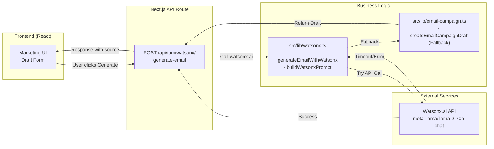

# Watsonx.ai Integration Guide

**Status:** Phase 1 Implementation Complete | **Last Updated:** May 9, 2026

## Overview

This guide covers the integration of IBM Watson's **watsonx.ai** for AI-powered email content generation in the Smallbox Marketing Dashboard. The integration uses the **Meta Llama 2 70B Chat** model to generate high-quality email drafts based on user inputs (template, tone, business name, audience, offer).

---

## Architecture



---

## Watsonx.ai Setup

### 1. Get Credentials

**Prerequisites:**
- IBM Cloud Account (free tier available: https://cloud.ibm.com/registration)
- Watsonx.ai access (free tier: 10k API calls/month)

**Steps:**
1. Go to [IBM Cloud Console](https://cloud.ibm.com/catalog)
2. Search for "Watsonx.ai"
3. Create an instance (free tier: **Lite plan**)
4. From the service dashboard, click **Manage** → **API Keys**
5. Create a new API key (or use existing)
6. Copy the API Key and save it

**Get Project ID:**
1. Go to [Watsonx.ai Studio](https://dataplatform.cloud.ibm.com/wx)
2. Click your project (or create one if needed)
3. Copy the **Project ID** from project settings

**Determine URL:**
- **US South:** `https://api.us-south.ml.cloud.ibm.com/ml/v1`
- **US East:** `https://api.us-east.ml.cloud.ibm.com/ml/v1`
- **UK South:** `https://api.eu-gb.ml.cloud.ibm.com/ml/v1`
- **EU DE:** `https://api.eu-de.ml.cloud.ibm.com/ml/v1`

### 2. Add to `.env.local`

```env
# IBM Watsonx.ai - Email content generation
WATSONX_API_KEY=<your_api_key_from_step_5>
WATSONX_PROJECT_ID=<your_project_id_from_step_3>
WATSONX_URL=https://api.us-south.ml.cloud.ibm.com/ml/v1
```

### 3. Verify Setup

```bash
# Restart dev server to pick up new env vars
npm run dev

# Navigate to Dashboard → Marketing → Email Campaigns
# Click "Generate Draft" → should see AI-generated email
```

---

## How It Works

### Request Flow

**User Action:** Click "Generate Draft" with inputs:
- Business Name: "Acme Corp"
- Audience: "B2B SaaS customers"
- Template: "promotional"
- Tone: "professional"
- Offer: "20% off annual plans"

**API Call:**
```bash
POST /api/ibm/watsonx/generate-email
{
  "businessName": "Acme Corp",
  "audience": "B2B SaaS customers",
  "template": "promotional",
  "tone": "professional",
  "offer": "20% off annual plans"
}
```

**Processing:**

1. **Validate** input parameters (template, tone must be valid types)
2. **Build Prompt** using `buildWatsonxPrompt()`:
   - Inject template-specific instructions
   - Add tone guidelines
   - Include 2-3 high-quality email examples
   - Add safety constraints (CAN-SPAM, character limits, JSON format)
3. **Call Watsonx.ai:**
   - Send prompt to Meta Llama 2 70B Chat model
   - Model generates email JSON (subject, preheader, body, CTA)
   - Set timeout to 20 seconds
4. **Parse Response:**
   - Extract JSON from model output
   - Validate all required fields present
5. **Fallback (if error):**
   - If API fails, timeout, or auth error → use local template generator
   - Return same structure but with `source: "local"`
6. **Return Response:**
   ```json
   {
     "draft": {
       "subject": "Acme Corp: Save 20% on annual plans",
       "preheader": "Limited time offer for B2B customers",
       "body": "...",
       "ctaLabel": "Claim Offer",
       "ctaUrl": "https://example.com/offer"
     },
     "source": "watsonx",
     "generatedAt": "2026-05-09T15:30:00.000Z",
     "recipientCount": 50
   }
   ```

### Code Structure

**File:** `src/lib/watsonx.ts`

**Key Types:**
```typescript
interface WatsonxEmailGenerationInput {
  businessName: string
  audience: string
  template: EmailCampaignTemplate
  tone: EmailCampaignTone
  offer: string
}

interface WatsonxGenerationResult {
  draft: EmailCampaignDraft
  source: "watsonx" | "local"
  generatedAt: string
  error?: string
}
```

**Key Functions:**

| Function | Purpose | Input | Output |
|----------|---------|-------|--------|
| `getWatsonxConfig()` | Load credentials from env | None | `{ apiKey, projectId, url }` |
| `buildWatsonxPrompt()` | Engineer advanced prompt | Template, tone, business context | Prompt string with examples |
| `generateEmailWithWatsonx()` | Main API caller | `WatsonxEmailGenerationInput` | `WatsonxGenerationResult` |

**Error Handling:**
- Missing env vars → return error result with source: "local"
- Timeout (20s) → abort request, fallback
- Auth error (401) → fallback
- Invalid JSON in response → fallback
- All returned drafts are valid and usable (graceful degradation)

---

## Prompt Engineering

### Advanced Prompt Structure

The prompt sent to Llama 2 includes:

1. **System Context:**
   - "You are an expert email marketing copywriter..."

2. **Task Specification:**
   - Template type (promotional, newsletter, announcement)
   - Target audience (e.g., "B2B SaaS customers")
   - Offer/message to promote

3. **Tone Guidance:**
   - Professional: "Use formal, business-appropriate language"
   - Friendly: "Use warm, conversational language"
   - Bold: "Use energetic, action-oriented language"

4. **High-Quality Examples:**
   - 2-3 real email examples per template
   - Show desired quality bar and format

5. **Output Format Spec:**
   - Strict JSON schema
   - Character limits (subject < 60, body < 400)
   - Field requirements (all required, no nulls)

6. **Safety Guardrails:**
   - Avoid spam triggers (ALL CAPS, excessive punctuation)
   - CAN-SPAM compliance
   - No misinformation

### Sample Prompt Output

```
You are an expert email marketing copywriter specializing in creating high-converting emails.

TASK: Generate a promotional email for Acme Corp targeting B2B SaaS customers. 
The email should promote: 20% off annual plans

TONE: Use formal, business-appropriate language. Be direct and confident.

TEMPLATE STYLE: Create a promotional email offering a deal or discount. 
Focus on value and urgency. End with a clear CTA.

EXAMPLES OF HIGH-QUALITY EMAILS:
Example 1:
Subject: Exclusive: 20% Off Today Only
Body: Hey! We know you love our products...
CTA Label: Shop Now

[... more examples ...]

REQUIREMENTS:
- Subject line: 40-60 characters
- Preheader: 40-80 characters
- Body: 200-400 characters
- CTA Label: 2-4 words
- Valid JSON output only

OUTPUT FORMAT (MUST BE VALID JSON):
{
  "subject": "...",
  "preheader": "...",
  "body": "...",
  "ctaLabel": "...",
  "ctaUrl": "https://example.com/offer"
}
```

---

## Fallback Mechanism

### Why Fallback?

- **Reliability:** API calls can fail (network, rate limits, server down)
- **Cost:** Watsonx calls incur charges; fallback is free
- **User Experience:** Better to provide a draft than an error

### How Fallback Works

**Condition:** Fallback triggered when:
- Watsonx env vars not configured
- API call times out (> 20s)
- Authentication fails (invalid API key)
- Malformed response (invalid JSON)
- Any network error

**Behavior:**
1. Log error with details
2. Call `createEmailCampaignDraft()` from `src/lib/email-campaign.ts`
3. Return response with `source: "local"` and `error` message
4. Frontend receives valid draft either way

**Example Response (on fallback):**
```json
{
  "draft": {
    "subject": "Acme Corp: 20% off annual plans.",
    "preheader": "Limited time offer for B2B SaaS customers",
    "body": "Check out our limited-time offer...",
    "ctaLabel": "Learn More",
    "ctaUrl": "https://example.com/offer"
  },
  "source": "local",
  "generatedAt": "2026-05-09T15:30:00.000Z",
  "watsonxError": "Request timeout after 20s"
}
```

---

## Monitoring & Metrics

### Logs

All watsonx calls are logged with:
- Timestamp
- Response time (ms)
- Success/failure
- Error message (if failed)

**Example log:**
```
[Watsonx] Generated email draft in 2341ms
[Watsonx] Error generating email (1234ms): Request timeout after 20s
```

### Tracking Fallback Rate

To monitor fallback usage:
1. Count requests where `source === "local"`
2. Compare to `source === "watsonx"`
3. Fallback rate should be < 5% in production
4. If > 20%, investigate API issues

### Cost Estimation

Watsonx.ai Lite plan includes:
- **Free tier:** 10,000 API calls/month
- **Pricing:** $0.001 per 100 tokens (after free tier)

**Example costs:**
- 100 drafts/month (typical): < 1% of free tier
- 1,000 drafts/month (high volume): ~$2/month
- 10,000 drafts/month (very high): ~$20/month

---

## Troubleshooting

### Issue: "Watsonx credentials not configured"

**Symptom:** Draft generation returns local templates, error message says missing credentials

**Solution:**
1. Check `.env.local` has all three vars: `WATSONX_API_KEY`, `WATSONX_PROJECT_ID`, `WATSONX_URL`
2. Verify values are not empty and don't have extra spaces
3. Restart dev server: `npm run dev`
4. Check console logs for exact error

### Issue: "Request timeout after 20s"

**Symptom:** Generate Draft takes > 20s, then shows local template

**Causes:**
- Watsonx API is slow (heavy load, network issues)
- Invalid prompt causing model to struggle

**Solution:**
1. Check Watsonx.ai status page: https://cloud.ibm.com/status?component=watsonx
2. Verify Project ID is correct (typo can cause validation delay)
3. Try again later (could be temporary load)
4. Check API key has correct permissions

### Issue: "Malformed JSON in Watsonx response"

**Symptom:** Watsonx calls succeed but return invalid JSON

**Causes:**
- Model hallucinating text before/after JSON
- Incomplete response

**Solution:**
1. Improve prompt instructions (add "Generate only JSON, no additional text")
2. Reduce model temperature (below 0.5) for more deterministic output
3. Consider using a different model (Granite-13B is more reliable for structured output)

### Issue: Generating same email for different tones

**Symptom:** Professional and Friendly templates look identical

**Causes:**
- Prompt not emphasizing tone enough
- Model ignoring tone instructions
- Prompt examples not diverse enough

**Solution:**
1. Add more diverse examples in prompt
2. Increase emphasis on tone section
3. Adjust model temperature (higher for more variation, e.g., 0.8-0.9)

---

## Testing

### Manual Testing

1. **Setup:**
   ```bash
   npm run dev
   ```

2. **Test Draft Generation:**
   - Go to Dashboard → Marketing → Email Campaigns
   - Fill form: Business: "TestCorp", Audience: "Testers", Template: "promotional", Tone: "friendly", Offer: "50% off"
   - Click "Generate Draft"
   - **Expected:** Email draft appears with friendly tone (conversational, warm language)
   - Check browser console → should see `source: "watsonx"` in response

3. **Test Fallback (simulate timeout):**
   - Set `WATSONX_API_KEY=invalid_key` in `.env.local`
   - Restart dev server
   - Try generating draft again
   - **Expected:** Draft appears with `source: "local"` and `watsonxError` in response

4. **Test Edge Cases:**
   - Very long offer text (> 100 chars) → should truncate in body
   - Special characters in business name → should escape properly
   - Rapid requests (10 drafts in quick succession) → check rate limit behavior

### Automated Testing (Optional)

If adding test suite:
```typescript
// Example test
describe("generateEmailWithWatsonx", () => {
  it("should generate valid draft with watsonx", async () => {
    const result = await generateEmailWithWatsonx({
      businessName: "Test",
      audience: "Testers",
      template: "promotional",
      tone: "friendly",
      offer: "50% off"
    });
    
    expect(result.draft.subject).toBeDefined();
    expect(result.draft.body.length).toBeLessThan(500);
    expect(result.source).toMatch(/watsonx|local/);
  });
});
```

---

## Future Improvements

### Model Switching
- Try other models: Granite-13B (better structured output), GPT-4 (highest quality)
- A/B test quality differences
- Implement model selection via UI

### Prompt Optimization
- Collect user feedback on generated emails
- Adjust prompt iteratively based on quality metrics
- Build template library with best prompts per use case

### Performance
- Add prompt caching to reduce API calls
- Batch generation if user requests multiple variations
- Implement client-side caching (so same inputs don't call API twice)

### Advanced Features
- Allow users to provide custom prompt instructions
- Support prompt versioning (track which prompt generated which email)
- Email A/B testing based on watsonx variants

---

## References

- **Watsonx.ai API Docs:** https://cloud.ibm.com/apidocs/watsonx-ai
- **Meta Llama 2 Docs:** https://www.llama.com/
- **Prompt Engineering Guide:** https://cloud.ibm.com/docs/watsonxdata?topic=watsonxdata-prompt-lab
- **IBM Cloud Free Tier:** https://www.ibm.com/cloud/free
- **Email Best Practices:** https://www.litmus.com/

---

**Last Updated:** May 9, 2026 | **Integrated by:** Implementation Phase 1
